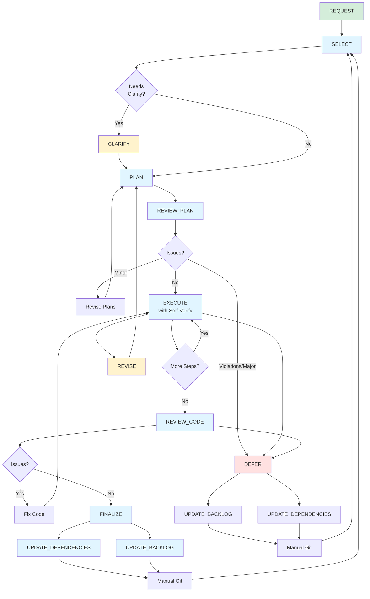

# Feature Development Workflow

This document provides the detailed workflow diagram and task descriptions for the feature development process.

## Workflow Diagram

This diagram shows the complete feature workflow and task dependencies.

## Feature Tasks

### Pre-Workflow
- **REQUEST**: Propose a new feature for evaluation and backlog entry

### Primary Workflow
- **SELECT**: Identify next feature from backlog based on dependencies and certainty; create feature branch; write comprehensive feature description with graybox scope, implementation approach, and testing protocol; save to `PLANS/<feature_name>_FEATURE.md`
- **CLARIFY**: (Optional) Eliminate ambiguity by asking targeted questions before implementation planning; captures visual references and concrete requirements
- **PLAN**: Break down feature description into atomic implementation steps with detailed system audit; update existing plan with changelog if it exists
- **REVIEW_PLAN**: Check implementation plan against principles; prepend changelog entry on re-review
- **EXECUTE**: Execute one major step from implementation checklist; run quality gates (build, format, smoke test); self-verify against principles; mark completed items and track changed files
- **REVIEW_CODE**: Comprehensive final code review against standards and principles; approve if passing
- **FINALIZE**: Update stack, backlog, archive documents; prepare for next feature

### Mid-Feature Adjustments
- **REVISE**: Update feature scope and/or implementation plan when requirements change during implementation

### Alternative Path
- **DEFER**: Cleanly back out of premature/unnecessary features identified during planning or implementation phase

## Workflow Paths

### Feature Request Path
1. REQUEST → Evaluate against principles & dependencies
2. Add to backlog if viable → Eventually pulled via SELECT

### Success Path
1. SELECT → (Optional: CLARIFY) → PLAN → REVIEW_PLAN (pass)
2. EXECUTE (loop until complete, with self-verification)
3. REVIEW_CODE (pass) → FINALIZE
4. UPDATE_DEPENDENCIES + UPDATE_BACKLOG → Manual Git → SELECT

### Deferral Path (Planning Phase)
1. SELECT → (Optional: CLARIFY) → PLAN → REVIEW_PLAN (violations/major issues)
2. DEFER
3. UPDATE_BACKLOG + UPDATE_DEPENDENCIES → Manual Git → SELECT

### Deferral Path (Implementation Phase)
1. During EXECUTE or REVIEW_CODE, discover blockers/missing prerequisites
2. DEFER
3. UPDATE_BACKLOG + UPDATE_DEPENDENCIES → Manual Git → SELECT

### Revision Path
1. REVIEW_PLAN identifies minor issues → Revise Plans → Re-review (prepends changelog to review)
2. EXECUTE self-verification identifies issues → Fix immediately before marking complete
3. REVIEW_CODE identifies issues → Fix Code → Re-implement step

### Mid-Feature Scope Change Path
1. During EXECUTE, discover need for scope adjustment
2. REVISE → Update feature description and/or implementation plan with changelog entries
3. Return to EXECUTE with synchronized plans

## Notes

- Short loops: implementation should be tight (1-3 complexity points)
- Interruptibility: revision loops at multiple decision points
- Clarification upfront: use CLARIFY when ambiguity exists; visual references prevent wasted iteration loops
- Deferral is cheap: celebrate avoiding expensive mistakes during planning or implementation
- Deferral phases: planning phase (principle violations, premature features) and implementation phase (missing prerequisites, blockers discovered)
- Bottom-up: dependency stack guides feature selection
- **Problem evidence required:** Features with backlog warnings ("may not be necessary," "low priority") require extra scrutiny during SELECT selection. Document specific gameplay moments or observations that motivate the feature before planning.
- Knowledge capture: document learnings at finalization/deferral while fresh
- Manual git: tasks prepare but don't execute commits
- Scope changes: REVISE keeps feature scope and implementation plan synchronized when discovery requires mid-feature adjustment
- Feature requests: REQUEST formalizes backlog entry with principle alignment and dependency analysis
- Plan versioning: PLAN and REVIEW_PLAN add changelog entries when updating existing plans; EXECUTE tracks changed files
- Re-reviews: REVIEW_PLAN prepends changelog entries on re-review to maintain historical context
- Retrospectives: Run RETROSPECTIVE every 5-10 iterations to review archived documents, identify patterns in what works/fails, and propose workflow improvements
- **Certainty calibration:** FINALIZE now tracks predicted vs actual certainty to improve planning accuracy over time
- **Backlog grooming:** Run BACKLOG_GROOMING periodically (every 2-3 iterations) to collapse completed work, prune low-certainty items, and refresh unlocked dependencies; keeps planning docs focused on future work rather than retrospectives
- **Organic scope evolution:** Debug tool scope growth acceptable if: (1) same session completion, (2) zero gameplay impact, (3) architectural improvements discovered. Scope can grow up to 2x estimate under these conditions without being considered harmful "scope creep." Example: Camera zoom (30→90 min) creating unified Debug Panel architecture. Distinguish from harmful feature bloat (multi-session coordination, gameplay changes, gold-plating).

## Proposed Numbering Scheme

Once workflow stabilizes, consider renaming files with 3-digit prefixes to provide visual roadmap while allowing growth:

### Primary Flow (000-099)
- **000_REQUEST** - Entry point: propose new feature
- **001_SELECT** - Select from backlog, create branch, write feature description
- **002_CLARIFY** - Optional: eliminate ambiguity
- **003_PLAN** - Break into atomic steps with system audit
- **004_REVIEW_PLAN** - Validate plans against principles
- **005_EXECUTE** - Execute one step with self-verification and quality gates
- **006_REVIEW_CODE** - Comprehensive final code review
- **007_FINALIZE** - Wrap up and prepare next

### Mid-Feature Adjustments (100-199)
- **100_REVISE** - Update feature scope and/or implementation plan

### Alternative Paths (200-299)
- **200_DEFER** - Clean exit from premature features

### Finalization Tasks (300-399)
- **300_UPDATE_DEPENDENCIES** - Update DEPENDENCY_STACK.md
- **301_UPDATE_BACKLOG** - Mark complete/deferred, document learnings
- **302_BACKLOG_GROOMING** - Periodic cleanup: collapse completed work, prune low-certainty items, update unlocked dependencies

### Version Control (400-499)
- **400_COMMIT** - Format and create git commits

Three-digit prefixes group by hundreds (0xx=main path, 1xx=adjustments, 2xx=alternatives, 3xx=cleanup, 4xx=git). Sequential numbering within each hundred allows up to 100 tasks per group. Defer renaming until workflow proves stable.
