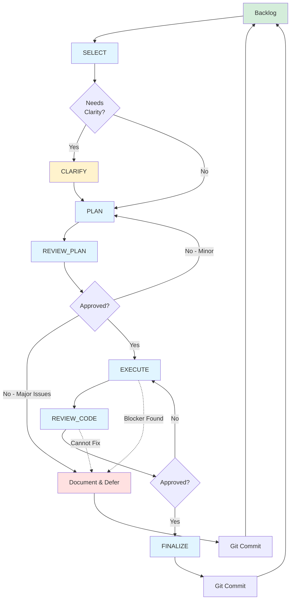

# Feature Development Workflow

**Build from certainty, validate continuously, strengthen the foundation.**

---

## The Purpose

This workflow is not process for its own sake—it's a philosophical framework that enforces principle-driven development. Each step serves to validate truth, challenge assumptions, and prevent complexity from entering the codebase.

**The workflow exists to protect the principles, not to track tasks.**

---

## The Philosophy

### Why This Flow?

1. **SELECT**: Ensures we build from foundation, not ambition
2. **CLARIFY**: Transforms features into systems before planning
3. **PLAN**: Proves we should build before we build
4. **REVIEW_PLAN**: Philosophical gatekeeper preventing bad systems
5. **EXECUTE**: Validates each stage before proceeding
6. **REVIEW_CODE**: Confirms principles maintained in reality
7. **FINALIZE**: Captures learning, calibrates certainty

### Why These Gates?

Each decision point asks: **Should we continue?**

- **After SELECT**: Is the foundation ready?
- **After CLARIFY**: Is this a system or just a feature?
- **After PLAN**: Will this uphold principles?
- **After EXECUTE**: Did implementation match plan?
- **After REVIEW_CODE**: Did code maintain principles?

**Every gate is an opportunity to discover we shouldn't proceed. This is success, not failure.**

### Why Can We Defer?

Deferral is cheap. Bad code is expensive. The workflow makes it easy to exit at any point when we learn something that invalidates the approach.

**Deferral is learning. Proceeding with doubt is technical debt.**

---

## Workflow Diagram



---

## The Tasks

Each task has a corresponding file in `TASKS/FEATURE/`:

### SELECT (`SELECT.md`)
**Purpose:** Choose what to build based on foundation certainty

**Output:**
- Feature branch created
- `PLANS/<name>_FEATURE.md` with initial description
- Commitment to build

**Philosophy:** Build from certainty toward uncertainty. Never build on sand.

**Next:** CLARIFY (if needed) or PLAN

---

### CLARIFY (`CLARIFY.md`) — Optional
**Purpose:** Challenge ambiguity, transform features into systems

**Output:**
- Mathematical precision demanded
- Visual references requested
- Minimal primitives identified
- Updates `PLANS/<name>_FEATURE.md`

**Philosophy:** Vague requirements compound into complex implementations. Demand clarity now or suffer confusion later.

**Next:** PLAN (when clarified)

---

### PLAN (`PLAN.md`)
**Purpose:** Prove the system should be built through staged validation

**Output:**
- `PLANS/<name>_PLAN.md` with reversible stages
- Mathematical validation strategy
- Debug visualization approach
- Risk assessment

**Philosophy:** A plan is not permission to build—it's proof we should build.

**Next:** REVIEW_PLAN

---

### REVIEW_PLAN (`REVIEW_PLAN.md`)
**Purpose:** Philosophical validation against all Six Pillars

**Output:**
- `PLANS/<name>_PLAN_REVIEW.md`
- Decision: APPROVED | REVISE | REJECT | DEFER

**Philosophy:** The best review rejects the plan. The second best demands simplification. Approval is last resort.

**Next:**
- If APPROVED → EXECUTE
- If REVISE → back to PLAN
- If REJECT/DEFER → document and exit

---

### EXECUTE (`EXECUTE.md`)
**Purpose:** Build validated stages, confirming principles at each step

**Output:**
- Implemented system
- Mathematical validation completed
- Debug visualization functional
- Updates stages in `PLANS/<name>_PLAN.md`

**Philosophy:** Truth through validation. Each stage proves itself before the next begins.

**Can discover:** Plan was flawed, need to defer

**Next:** REVIEW_CODE (when all stages complete)

---

### REVIEW_CODE (`REVIEW_CODE.md`)
**Purpose:** Verify implementation upholds principles and enables emergence

**Output:**
- `PLANS/<name>_CODE_REVIEW.md`
- Decision: APPROVED | REVISE | ROLLBACK

**Philosophy:** Code that works but violates principles is technical debt incarnate.

**Next:**
- If APPROVED → FINALIZE
- If REVISE → back to EXECUTE
- If ROLLBACK → defer

---

### FINALIZE (`FINALIZE.md`)
**Purpose:** Close cycle with learning, calibrate certainty, strengthen foundation

**Output:**
- Completed `PLANS/<name>_FEATURE.md` with reflections
- Updated `PLANS/DEPENDENCY_STACK.md`
- Updated `PLANS/DESIGN_BACKLOG.md` with discoveries
- Captured wisdom and patterns

**Philosophy:** Every feature teaches us about the principles. Did we listen?

**Next:** Git commit, then SELECT new work

---

## Workflow Paths

### The Success Path
```
Backlog → SELECT → [CLARIFY] → PLAN → REVIEW_PLAN →
EXECUTE (staged loop) → REVIEW_CODE → FINALIZE → Git → Backlog
```

**What this achieves:**
- System built from validated foundation
- All principles maintained throughout
- Emergence documented and celebrated
- Foundation strengthened for next system

---

### The Deferral Path (Planning Phase)
```
SELECT → [CLARIFY] → PLAN → REVIEW_PLAN →
[REJECT/DEFER decision] → Document learning → Git → Backlog
```

**Why this happens:**
- Foundation uncertain (<90%)
- Principles cannot be maintained
- Mathematical validation unclear
- Complexity cannot be justified

**This is success:** We learned before implementation.

**How to defer:**
- Document deferral reason in `PLANS/<name>_FEATURE.md`
- Update backlog if needed
- Commit documentation
- Return to SELECT for different work

---

### The Deferral Path (Execution Phase)
```
EXECUTE → [Discovers blocker] →
Document learning → Git → Backlog
```

**Why this happens:**
- Plan revealed as flawed
- Mathematical incorrectness discovered
- Integration impossible
- Principles violated in practice

**This is success:** We learned through validation, not production bugs.

**How to defer:**
- Document what was learned in plan files
- Note what blocked progress
- Commit all documentation
- Foundation certainty may need adjustment

---

### The Revision Path
```
PLAN → REVIEW_PLAN → [Minor issues] → PLAN (revise)
or
EXECUTE → [Code issues] → REVIEW_CODE → [Issues] → EXECUTE (fix)
```

**Why this happens:**
- Scope needs minor adjustment
- Stage decomposition wrong
- Better approach discovered
- Code doesn't meet standards

**This is learning:** Plans and code improve through feedback.

---

## The Principles of This Workflow

### 1. Radical Simplicity
**In workflow:** Each task does one thing
**Why:** Complex workflows hide what matters
**Result:** Clear decision points, obvious next steps

### 2. Fundamental Composable Functions
**In workflow:** Tasks build on validated previous work
**Why:** Can't plan without clarity, can't execute without plan
**Result:** Dependencies prevent skipping validation

### 3. Solid Mathematical Foundations
**In workflow:** Mathematical validation required before execution
**Why:** Unvalidated math compounds into chaos
**Result:** Every system has proven correctness

### 4. Emergent Behavior
**In workflow:** Finalization captures unexpected discoveries
**Why:** Emergence validates we built systems, not features
**Result:** Each system enables more than intended

### 5. Consistency
**In workflow:** Same process every time, no exceptions
**Why:** Inconsistent process produces inconsistent results
**Result:** Reliable development, predictable outcomes

### 6. Principled Development
**In workflow:** Every step traces to principles
**Why:** Process without principles is cargo cult
**Result:** Can justify every decision made

---

## Key Operational Guidelines

### Build From Certainty
- SELECT respects dependency stack
- Foundation ≥90% certain before building
- Truth flows upward, never down

### Validate Continuously
- Mathematical validation before integration
- Debug visualization at every stage
- Principle checks at each gate

### Exit Freely
- Deferral available at any point
- No shame in discovering we shouldn't build
- Learning is success

### Document Learning
- Capture emergence as it happens
- Calibrate certainty through reflection
- Strengthen principles through experience

### Strengthen Foundation
- Each completed system raises certainty
- Failed attempts lower it honestly
- Always know where we stand

---

## Workflow Metrics

### Healthy Indicators
- High deferral rate in planning (catching issues early)
- Low deferral rate in execution (plans are good)
- Emergence documented in most features
- Foundation certainty trending upward
- Principle adherence scores high

### Warning Signs
- Zero deferrals (not being critical enough)
- High execution deferrals (planning insufficient)
- No emergence documented (prescribing outcomes)
- Foundation certainty stagnant or declining
- Principle violations increasing

---

## When to Use Each Task

### Use SELECT When:
- Foundation ready for this system
- Clear dependency alignment
- Certainty threshold met

### Use CLARIFY When:
- Request uses vague language
- Mathematical precision unclear
- Might be feature instead of system
- Validation approach uncertain

### Defer (Exit Workflow) When:
- Foundation uncertain
- Principles cannot be maintained
- Complexity unjustified
- Better to wait and learn
- Execution reveals insurmountable issues

### Revise (Within Tasks) When:
- Minor plan adjustments needed
- Better decomposition discovered
- Scope slightly wrong but fixable
- Code issues can be fixed

---

## Task Files Reference

All task files are in `TASKS/FEATURE/`:

```
TASKS/FEATURE/
├── SELECT.md          - Choose from backlog
├── CLARIFY.md         - Challenge ambiguity (optional)
├── PLAN.md            - Prove we should build
├── REVIEW_PLAN.md     - Validate against principles
├── EXECUTE.md         - Build validated stages
├── REVIEW_CODE.md     - Verify principles maintained
├── FINALIZE.md        - Capture learning, update docs
└── WORKFLOW.md        - This document
```

Documentation is created in `PLANS/`:
```
PLANS/
├── <name>_FEATURE.md      - Initial description & final reflection
├── <name>_PLAN.md         - Stages and validation strategy
├── <name>_PLAN_REVIEW.md  - Plan approval/rejection
├── <name>_CODE_REVIEW.md  - Code approval/rejection
├── DEPENDENCY_STACK.md    - Foundation state
└── DESIGN_BACKLOG.md      - Future systems
```

---

## The Commitment

This workflow exists to:
- **Protect principles** over shipping features
- **Enable learning** over preventing failure
- **Build systems** over adding features
- **Strengthen foundation** over piling on top
- **Document truth** over maintaining illusions

Never use this workflow to:
- Prescribe outcomes over enabling emergence
- Rush through gates to "get it done"
- Skip validation to save time
- Maintain failing approaches out of stubbornness
- Build on uncertain foundations

**The workflow is not the goal. Principle-aligned systems are the goal. The workflow serves the principles.**

**This is the way.**