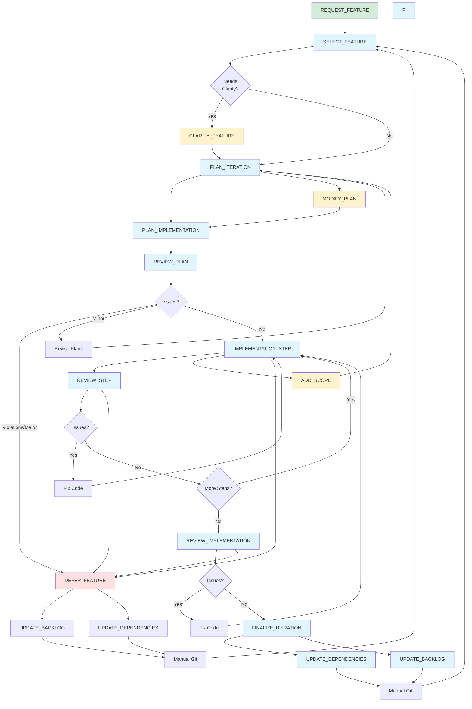

# Feature Development Workflow

This document provides the detailed workflow diagram and task descriptions for the feature development process.

## Workflow Diagram

This diagram shows the complete iteration workflow and task dependencies.

## Feature Tasks

### Pre-Workflow
- **REQUEST_FEATURE**: Propose a new feature for evaluation and backlog entry

### Primary Workflow
- **SELECT_FEATURE**: Identify next feature from backlog based on dependencies and certainty; write high-level feature description and save to `PLANS/feature_<feature_name>.md`
- **CLARIFY_FEATURE**: (Optional) Eliminate ambiguity by asking targeted questions before planning; captures visual references and concrete requirements
- **PLAN_ITERATION**: Create detailed iteration plan from feature description with graybox scope and testing protocol
- **PLAN_IMPLEMENTATION**: Break down iteration plan into atomic implementation steps; update existing plan with changelog if it exists
- **REVIEW_PLAN**: Check iteration and implementation plans against principles; prepend changelog entry on re-review
- **IMPLEMENTATION_STEP**: Execute one major step from implementation checklist; mark completed items and track changed files
- **REVIEW_STEP**: Verify last completed step against plan alignment, code standards, and gameplay-first principles; provide inline feedback
- **REVIEW_IMPLEMENTATION**: Verify code against standards and principles; approve if passing
- **FINALIZE_ITERATION**: Update stack, backlog, archive documents; prepare for next feature

### Mid-Iteration Adjustments
- **ADD_SCOPE**: Add requirements to an active iteration plan (triggers re-decompose)
- **MODIFY_PLAN**: Update implementation plan to match modified iteration scope

### Alternative Path
- **DEFER_FEATURE**: Cleanly back out of premature/unnecessary features identified during planning or implementation phase

## Workflow Paths

### Feature Request Path
1. REQUEST_FEATURE → Evaluate against principles & dependencies
2. Add to backlog if viable → Eventually pulled via SELECT_FEATURE

### Success Path
1. SELECT_FEATURE → (Optional: CLARIFY_FEATURE) → PLAN_ITERATION → PLAN_IMPLEMENTATION → REVIEW_PLAN (pass)
2. IMPLEMENTATION_STEP → REVIEW_STEP (loop until complete)
3. REVIEW_IMPLEMENTATION (pass) → FINALIZE_ITERATION
4. UPDATE_DEPENDENCIES + UPDATE_BACKLOG → Manual Git → SELECT_FEATURE

### Deferral Path (Planning Phase)
1. SELECT_FEATURE → (Optional: CLARIFY_FEATURE) → PLAN_ITERATION → PLAN_IMPLEMENTATION → REVIEW_PLAN (violations/major issues)
2. DEFER_FEATURE
3. UPDATE_BACKLOG + UPDATE_DEPENDENCIES → Manual Git → SELECT_FEATURE

### Deferral Path (Implementation Phase)
1. During IMPLEMENTATION_STEP, REVIEW_STEP, or REVIEW_IMPLEMENTATION, discover blockers/missing prerequisites
2. DEFER_FEATURE
3. UPDATE_BACKLOG + UPDATE_DEPENDENCIES → Manual Git → SELECT_FEATURE

### Revision Path
1. REVIEW_PLAN identifies minor issues → Revise Plans → Re-review (prepends changelog to review)
2. REVIEW_STEP identifies issues → Fix Code → Re-implement step
3. REVIEW_IMPLEMENTATION identifies issues → Fix Code → Re-implement

### Mid-Iteration Scope Change Path
1. During IMPLEMENTATION_STEP, discover need for scope adjustment
2. ADD_SCOPE → Update iteration plan with changelog entry
3. MODIFY_PLAN → Update implementation plan with changelog entry
4. PLAN_IMPLEMENTATION → Synchronize implementation steps (adds changelog if updating existing plan)
5. Return to IMPLEMENTATION_STEP with synchronized plans

## Notes

- Short loops: implementation should be tight (1-3 complexity points)
- Interruptibility: revision loops at multiple decision points
- Clarification upfront: use CLARIFY_FEATURE when ambiguity exists; visual references prevent wasted iteration loops
- Deferral is cheap: celebrate avoiding expensive mistakes during planning or implementation
- Deferral phases: planning phase (principle violations, premature features) and implementation phase (missing prerequisites, blockers discovered)
- Bottom-up: dependency stack guides feature selection
- **Problem evidence required:** Features with backlog warnings ("may not be necessary," "low priority") require extra scrutiny during SELECT_FEATURE selection. Document specific gameplay moments or observations that motivate the feature before planning.
- Knowledge capture: document learnings at finalization/deferral while fresh
- Manual git: tasks prepare but don't execute commits
- Scope changes: ADD_SCOPE + MODIFY_PLAN + PLAN_IMPLEMENTATION keep plans synchronized when discovery requires mid-iteration adjustment
- Feature requests: REQUEST_FEATURE formalizes backlog entry with principle alignment and dependency analysis
- Plan versioning: PLAN_IMPLEMENTATION and REVIEW_PLAN add changelog entries when updating existing plans; IMPLEMENTATION_STEP tracks changed files
- Re-reviews: REVIEW_PLAN prepends changelog entries on re-review to maintain historical context
- Retrospectives: Run RETROSPECTIVE every 5-10 iterations to review archived documents, identify patterns in what works/fails, and propose workflow improvements
- **Certainty calibration:** FINALIZE_ITERATION now tracks predicted vs actual certainty to improve planning accuracy over time
- **Backlog grooming:** Run BACKLOG_GROOMING periodically (every 2-3 iterations) to collapse completed work, prune low-certainty items, and refresh unlocked dependencies; keeps planning docs focused on future work rather than retrospectives

## Proposed Numbering Scheme

Once workflow stabilizes, consider renaming files with 3-digit prefixes to provide visual roadmap while allowing growth:

### Primary Flow (000-099)
- **000_REQUEST_FEATURE** - Entry point: propose new feature
- **001_SELECT_FEATURE** - Select from backlog
- **002_CLARIFY_FEATURE** - Optional: eliminate ambiguity
- **003_PLAN_ITERATION** - Create iteration plan
- **004_PLAN_IMPLEMENTATION** - Break into atomic steps
- **005_REVIEW_PLAN** - Validate plans against principles
- **006_IMPLEMENTATION_STEP** - Execute one step
- **007_REVIEW_STEP** - Validate completed step
- **008_REVIEW_IMPLEMENTATION** - Final code review
- **009_FINALIZE_ITERATION** - Wrap up and prepare next

### Mid-Iteration Adjustments (100-199)
- **100_ADD_SCOPE** - Add requirements to active iteration
- **101_MODIFY_PLAN** - Update implementation plan

### Alternative Paths (200-299)
- **200_DEFER_FEATURE** - Clean exit from premature features

### Finalization Tasks (300-399)
- **300_UPDATE_DEPENDENCIES** - Update DEPENDENCY_STACK.md
- **301_UPDATE_BACKLOG** - Mark complete/deferred, document learnings
- **302_BACKLOG_GROOMING** - Periodic cleanup: collapse completed work, prune low-certainty items, update unlocked dependencies

### Version Control (400-499)
- **400_COMMIT** - Format and create git commits

Three-digit prefixes group by hundreds (0xx=main path, 1xx=adjustments, 2xx=alternatives, 3xx=cleanup, 4xx=git). Sequential numbering within each hundred allows up to 100 tasks per group. Defer renaming until workflow proves stable.
