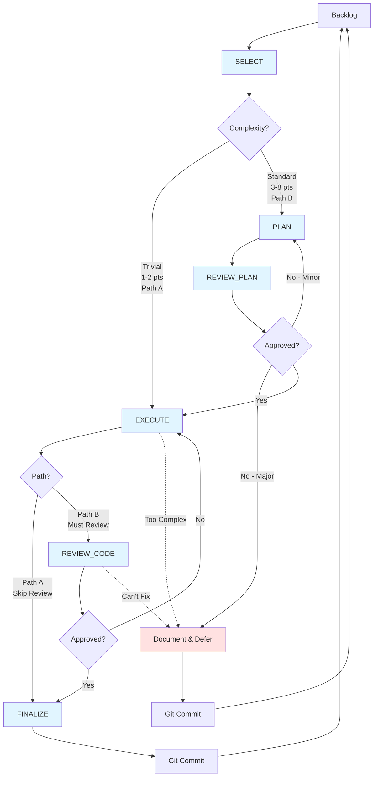

# Improve Workflow

**Remove complexity, restore principles, simplify continuously.**

---

## The Purpose

This workflow is not refactoring—it's principled simplification. Every improvement must make the codebase simpler, restore a violated principle, and be measurably better.

**The improvement workflow exists to remove complexity, not reorganize it.**

---

## The Philosophy

### Why Improve?

Code degrades. Complexity accumulates. Principles get violated under pressure. The improvement workflow is continuous housekeeping—finding violations and restoring principles through simplification.

**Improvements make code disappear. Features make code appear.**

### Why Two Paths?

Not all violations require planning:

**Path A (Trivial):** Obvious fixes that insult our principles. Delete immediately.

**Path B (Standard):** Complex entanglements requiring careful untangling. Plan stages.

**The distinction is not bureaucratic—it's respect for risk vs efficiency.**

### The Hierarchy of Improvement

1. **Delete first** - Remove entirely if possible
2. **Simplify second** - Reduce complexity if deletion impossible
3. **Document last** - Explain essential complexity

**Most improvements should be deletions. The best improvement removes entire files.**

---

## Workflow Diagram



---

## The Tasks

Each task serves the goal of simplification:

### SELECT (`SELECT.md`)
**Purpose:** Choose violation to fix, classify complexity

**Output:**
- Improvement branch created
- `PLANS/IMPROVE_<name>.md` with violation description
- Path determination: A (trivial) or B (standard)

**Philosophy:** Not all violations need planning. Obvious deletions should be fast.

**Decides:** Path A or Path B

---

### PLAN (`PLAN.md`) — Path B Only
**Purpose:** Prove simplification is possible through deletion/reduction

**Output:**
- Staged simplification approach
- Complexity reduction metrics
- Risk assessment

**Philosophy:** The best plan removes code. The second best simplifies it. Adding is failure.

**Next:** REVIEW_PLAN

---

### REVIEW_PLAN (`REVIEW_PLAN.md`) — Path B Only
**Purpose:** Verify simplification will be achieved

**Output:**
- Decision: APPROVED | REVISE | REJECT
- Simplification metrics validated
- Risk/reward assessment

**Philosophy:** If complexity doesn't decrease, reject immediately.

**Next:**
- APPROVED → EXECUTE
- REVISE → back to PLAN
- REJECT → defer

---

### EXECUTE (`EXECUTE.md`) — Both Paths
**Purpose:** Transform violation into simplification

**Path A (Trivial):**
- Make obvious change
- Verify improvement
- Skip to FINALIZE

**Path B (Standard):**
- Execute staged simplification
- Validate each stage
- Continue to REVIEW_CODE

**Philosophy:** Deletion is victory. Every line removed is celebrated.

**Path A Next:** FINALIZE
**Path B Next:** REVIEW_CODE

---

### REVIEW_CODE (`REVIEW_CODE.md`) — Path B Only
**Purpose:** Verify simplification achieved and principles restored

**Output:**
- Decision: APPROVED | REVISE | REJECT
- Complexity reduction confirmed
- Principle restoration validated

**Philosophy:** If net complexity increased, we failed. Reflect why.

**Next:**
- APPROVED → FINALIZE
- REVISE → back to EXECUTE
- REJECT → defer

---

### FINALIZE (`FINALIZE.md`) — Both Paths
**Purpose:** Measure simplification, capture pattern, remove from backlog

**Output:**
- Complexity metrics (before/after)
- Pattern identification
- Principle restoration confirmed
- Item removed from backlog
- Learnings captured

**Philosophy:** Every improvement teaches pattern recognition. Name patterns to recognize them.

**Next:** Git commit, then SELECT new violation

---

### REVIEW_CODEBASE (`REVIEW_CODEBASE.md`) — Separate
**Purpose:** Find principle violations and populate backlog

**When to use:** Between features, periodically, after major changes

**Output:** `PLANS/IMPROVE_BACKLOG.md` updated with violations

**Philosophy:** Violations accumulate. Regular audits find them before they compound.

---

## Workflow Paths

### Path A: Trivial (1-2 points)
```
Backlog → SELECT → EXECUTE → FINALIZE → Git → Backlog
```

**Use when:**
- Single file change
- Obvious fix
- No dependencies affected
- Risk is minimal

**Examples:**
- Remove unused include
- Delete dead code
- Fix naming violation
- Extract magic number

**Philosophy:** Speed matters for trivial fixes. Don't over-process deletion.

---

### Path B: Standard (3-8 points)
```
Backlog → SELECT → PLAN → REVIEW_PLAN →
EXECUTE → REVIEW_CODE → FINALIZE → Git → Backlog
```

**Use when:**
- Multiple files affected
- Dependencies must be untangled
- Risk of breaking things
- Simplification strategy needed

**Examples:**
- Dependency untangling
- Accumulated state removal
- Magic number derivation
- Responsibility separation

**Philosophy:** Complex simplification requires planning. Haste creates more complexity.

---

### The Deferral Path
```
SELECT → [PLAN] → REVIEW_PLAN → REJECT →
Document reason → Git → Backlog
```

**Why this happens:**
- Violation can't be fixed without breaking things
- Simplification would increase complexity elsewhere
- Foundation too unstable
- Better to defer and learn

**This is success:** We learned before making things worse.

---

## The Principles of This Workflow

### 1. Radical Simplicity
**In workflow:** Two paths—simple for trivial, staged for complex
**Why:** Process overhead is complexity. Minimize where possible.
**Result:** Fast for simple, safe for complex

### 2. Fundamental Composable Functions
**In workflow:** Each task has clear input/output
**Why:** Improvements compose. Small fixes compound into simplification.
**Result:** Can chain improvements safely

### 3. Solid Mathematical Foundations
**In workflow:** Measure complexity before and after
**Why:** Can't prove improvement without measurement
**Result:** Objective validation of simplification

### 4. Emergent Behavior
**In workflow:** Capture patterns that emerge from violations
**Why:** Violations repeat. Patterns help recognize them.
**Result:** Faster identification of future violations

### 5. Consistency
**In workflow:** Same process every time for each path
**Why:** Consistent process produces consistent results
**Result:** Reliable simplification

### 6. Principled Development
**In workflow:** Every fix restores a principle
**Why:** Improvements without principle guidance are just change
**Result:** Codebase aligns with principles over time

---

## Complexity Classification

### Path A: Trivial (1-2 points)

**Characteristics:**
- Single file or closely related files
- Obvious what to do
- Low risk of breakage
- Quick to verify

**Examples:**
```
1 point:
- Remove unused #include
- Delete commented code
- Fix snake_case violation

2 points:
- Remove unused function
- Extract single magic number
- Delete dead code path
```

**Decision:** If it's obvious and safe, use Path A.

---

### Path B: Standard (3-8 points)

**Characteristics:**
- Multiple files or systems
- Requires analysis
- Risk of breaking things
- Needs staged approach

**Examples:**
```
3-4 points:
- Untangle small dependency
- Remove accumulated state pattern
- Document magic numbers with derivation

5-6 points:
- Separate mixed responsibilities
- Remove dual-reference violation
- Untangle circular dependency

7-8 points:
- Major dependency untangling
- Large subsystem simplification
- Remove entire abstraction layer
```

**Decision:** If it requires thought or has risk, use Path B.

---

## Key Operational Guidelines

### Always Try Deletion First
- Can we remove it entirely?
- What breaks if deleted?
- Is the break acceptable?

**Only if deletion fails, try simplification.**

### Measure Complexity Reduction
- Lines before and after
- Dependencies before and after
- Special cases before and after

**If metrics don't improve, reject the change.**

### Restore Principles
- Which pillar was violated?
- Is it now restored?
- Did we violate others fixing it?

**Net principle impact must be positive.**

### Capture Patterns
- What caused this violation?
- How do we recognize it?
- Where else might it exist?

**Pattern recognition prevents future violations.**

### Remove from Backlog
- Delete the item when fixed
- Add new violations found
- Keep backlog current

**Best backlog item is one removed from code.**

---

## When to Use Each Path

### Use Path A When:
- Fix is obvious
- Single file or tightly coupled files
- No risk of cascade
- Can verify immediately

### Use Path B When:
- Multiple systems involved
- Risk of breaking things
- Needs staged approach
- Complexity reduction unclear

### Defer When:
- Foundation too unstable
- Would increase complexity elsewhere
- Can't measure improvement
- Better to wait and learn

---

## Workflow Metrics

### Healthy Indicators
- High Path A usage (catching violations early)
- Positive complexity reduction in all fixes
- Patterns being identified and documented
- Backlog shrinking or stable
- Principle adherence improving

### Warning Signs
- No deletions (only moving complexity)
- Complexity increasing despite "improvements"
- Same violations recurring
- Backlog growing uncontrollably
- No patterns being recognized

---

## Integration with Feature Workflow

### When to Improve

**Between features:**
- Foundation stable
- No active development
- Clear violations in backlog

**During features:**
- Only if blocking progress
- Keep separate branch
- Don't mix feature and improvement work

**After major changes:**
- Run REVIEW_CODEBASE
- Update backlog
- Plan improvement work

### Stability Requirements

Only improve when foundation ≥70% certain:
- Too unstable: improvements might get reverted
- Too active: changes conflict with improvements
- Just right: safe to simplify

---

## Task Files Reference

All task files are in `TASKS/IMPROVE/`:

```
TASKS/IMPROVE/
├── SELECT.md           - Choose violation, classify
├── PLAN.md             - Plan simplification (Path B)
├── REVIEW_PLAN.md      - Validate plan (Path B)
├── EXECUTE.md          - Remove complexity (both paths)
├── REVIEW_CODE.md      - Verify simplification (Path B)
├── FINALIZE.md         - Measure and document (both paths)
├── REVIEW_CODEBASE.md  - Find violations (separate)
└── WORKFLOW.md         - This document
```

Documentation in `PLANS/`:
```
PLANS/
├── IMPROVE_<name>.md    - All phases appended to one file
└── IMPROVE_BACKLOG.md   - Principle violations to fix
```

---

## The Commitment

This workflow exists to:
- **Remove complexity** over reorganizing it
- **Restore principles** over changing code
- **Measure improvement** over assuming it
- **Capture patterns** over fixing symptoms
- **Simplify continuously** over accumulating debt

Never use this workflow to:
- Add abstractions or layers
- Move complexity to different files
- "Clean up" without reducing lines
- Fix without measuring improvement
- Skip validation to move faster

**The improvement workflow is not refactoring. It's principled deletion.**

**This is the way.**