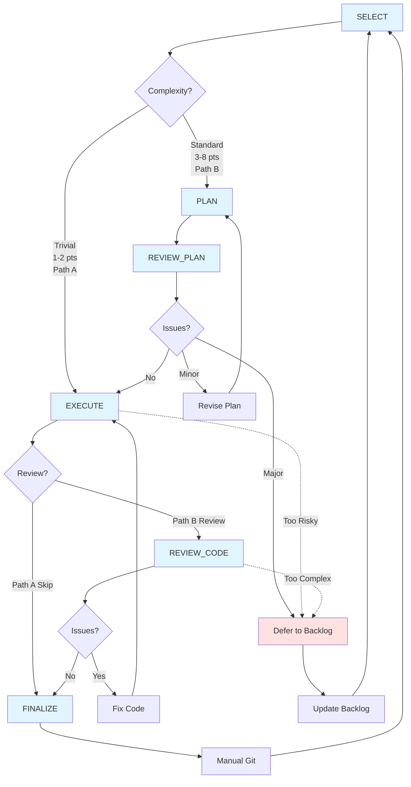

# Improve Workflow

This diagram shows the unified improvement workflow for code quality, architectural violations, tech debt, and pattern extraction from IMPROVE_BACKLOG.md.

## Tasks

### Primary Workflow
- **SELECT**: Choose one item from IMPROVE_BACKLOG.md based on severity/priority and stability; classify as Trivial or Standard
- **PLAN**: (Standard only) Create branch; analyze impact and risk; write detailed plan with validation checklist
- **REVIEW_PLAN**: (Standard only) Verify plan against principles; check for scope creep and risk vs reward
- **EXECUTE**: Implement the change in logical stages; validate at checkpoints
- **REVIEW_CODE**: (Standard only) Comprehensive code review for correctness, principle alignment, and side effects
- **FINALIZE**: Update IMPROVE_BACKLOG.md (move to Completed section); document learnings; prepare commit message

### Supporting Tasks (Shared)
- **COMMIT**: Format and create git commits following project conventions
- **REVIEW_CODEBASE**: Scan codebase for quality issues to populate IMPROVE_BACKLOG.md

## Workflow Paths

### Path A: Trivial (1-2 points, single file, mechanical)
1. SELECT → Create branch, classify as Trivial
2. EXECUTE → Make the fix
3. FINALIZE → Update backlog, prepare commit
4. Manual Git → SELECT

### Path B: Standard (3-8 points, multi-file or architectural)
1. SELECT → Create branch, classify as Standard
2. PLAN → Detail the approach
3. REVIEW_PLAN (pass) → EXECUTE
4. EXECUTE → Implement in stages
5. REVIEW_CODE (pass) → FINALIZE
6. Manual Git → SELECT

### Revision Path (Planning Phase)
1. REVIEW_PLAN identifies minor issues → Revise Plan → Re-plan
2. REVIEW_PLAN identifies major issues → Defer to Backlog → SELECT

### Revision Path (Execution Phase)
1. REVIEW_CODE identifies issues → Fix Code → Re-execute
2. REVIEW_CODE (pass) → FINALIZE

### Abort Path (Discovery Phase)
1. During EXECUTE or REVIEW_CODE, discover change is too risky/complex
2. Document learnings → Defer to Backlog → SELECT

## Notes

- **Dual-tier complexity**: Trivial (1-2 pts) skips planning/review; Standard (3-8 pts) gets full workflow
- **Stability requirement**: Only improve systems at ≥70% certainty (check DEPENDENCY_STACK.md tree visualization)
- **Rule of three**: For pattern extraction, need 3+ occurrences unless establishing canonical data source (document exception in plan)
- **No scope creep**: Fix only what's described; track new discoveries separately
- **Stage verification**: Standard changes execute in logical stages with validation between each
- **Manual progression**: Each task initiated manually; user decides when to proceed (except automated trivial path)
- **Learning capture**: Document insights in Completed section (what worked, what to avoid, patterns discovered)
- **Single document**: All improvement phases append to `PLANS/IMPROVE_<name>.md` (description → plan → review → execution → code review → finalization) for complete history; no separate REVIEW documents
- **Always branch**: Create `improve/<name>` branch for ALL improvements (trivial and standard) to isolate work and enable clean rollback
- **Batch opportunity**: FINALIZE notes similar items for future batch processing

## Complexity Classification

**Trivial (Path A: 1-2 points)**
- Remove redundant include
- Fix typo or naming case
- Adjust formatting (single location)
- Remove commented-out code
- Add missing const qualifier (no behavior change)
- Extract file-scope constant (single file)

**Standard (Path B: 3-8 points)**
| Points | Scope | Examples |
|--------|-------|----------|
| 3-4 | Multi-file, simple pattern | Extract helper function used 3+ times, consolidate duplicates |
| 5-6 | Cross-system, architectural | Move type to proper layer, extract interface |
| 7-8 | Complex refactor | Decouple layers, restructure data flow, major pattern extraction |

## Usage

**Entry Point:** User invokes SELECT (e.g., "pick an improvement", "work on tech debt", "fix architecture issue")

**Automated Flow (Trivial):** SELECT → EXECUTE → FINALIZE

**Manual Flow (Standard):** User advances through each stage

**Exit Point:** Agent stops after FINALIZE; user handles git commit

## Integration with Other Workflows

- **From FEATURE workflow**: During feature work, populate IMPROVE_BACKLOG with discovered issues/patterns
- **Interleave improvements**: Run between feature iterations when systems reach stability threshold
- **Prerequisite for features**: Some features may require architectural improvements first (check dependency notes)
- **Batch similar**: Group related trivial fixes for single commit

## Stability Gates

Before selecting an improvement, verify from DEPENDENCY_STACK.md tree structure:
- **70%+ certainty**: System is mature enough to improve safely
- **No active development**: System isn't currently being modified by feature work
- **Proven patterns**: For extractions, "rule of three" verified (3+ uses)

Defer improvements on unstable or actively-changing systems.

## Automation Guidelines

**Path A (Trivial) - Recommended for automation:**
- User invokes SELECT
- Agent auto-progresses: SELECT → EXECUTE → FINALIZE
- User reviews prepared commit, then commits manually

**Path B (Standard) - Manual progression:**
- User explicitly advances each stage
- Allows for thought/planning between phases
- Safer for complex architectural changes
