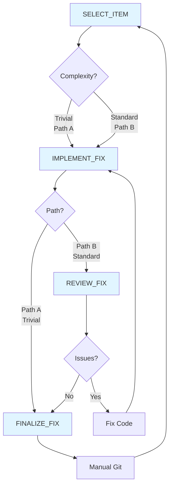

# Maintenance Workflow

This diagram shows the maintenance fix workflow for items from MAINTENANCE_BACKLOG.md.

## Tasks

### Primary Workflow
- **SELECT_ITEM**: Select one item from MAINTENANCE_BACKLOG.md based on severity and clarity; classify as Trivial (Path A) or Standard (Path B)
- **IMPLEMENT_FIX**: Execute the suggested fix from backlog; minimal changes, strict adherence to coding standards
- **REVIEW_FIX**: (Path B only) Verify fix quality against standards; check for side effects and scope creep
- **FINALIZE_FIX**: Update MAINTENANCE_BACKLOG.md (move to Completed section); prepare commit message

### Supporting Tasks (Shared)
- **COMMIT**: Format and create git commits following project conventions

## Workflow Paths

### Path A: Trivial Fix (< 5 lines, single file, mechanical)
1. SELECT_ITEM → Classify as Trivial
2. IMPLEMENT_FIX → Execute fix
3. FINALIZE_FIX → Update backlog, prepare commit
4. Manual Git → SELECT_ITEM

### Path B: Standard Fix (Multi-line, behavior change, or multi-file)
1. SELECT_ITEM → Classify as Standard
2. IMPLEMENT_FIX → Execute fix
3. REVIEW_FIX (pass) → FINALIZE_FIX
4. Manual Git → SELECT_ITEM

### Revision Path
1. REVIEW_FIX identifies issues → Fix Code → Re-implement
2. REVIEW_FIX (pass) → FINALIZE_FIX

## Notes

- **Automated progression**: SELECT_ITEM → IMPLEMENT_FIX → REVIEW_FIX (if needed) → FINALIZE_FIX happens automatically; user invokes once at SELECT_ITEM
- **Tight loops**: Most fixes are 1-2 complexity points
- **Two-tier review**: Trivial fixes skip review; standard fixes get verification
- **Severity-first**: Pick highest severity items (Critical > High > Medium > Low)
- **No scope creep**: Fix only what's described; track new issues separately
- **Batch opportunity**: FINALIZE_FIX notes similar items for future batch processing
- **Manual git**: Tasks prepare but don't execute commits (user commits after FINALIZE_FIX)
- **Isolation**: Avoid touching uncertain or actively-changing systems
- **Learning capture**: Document insights in Completed section
- **Experimental**: This automated workflow is a trial—if successful, patterns may inform FEATURE workflow improvements

## Usage

**Entry Point:** User invokes SELECT_ITEM (e.g., "pick a maintenance item", "work on maintenance")

**Automated Flow:** Agent progresses automatically through IMPLEMENT_FIX → REVIEW_FIX (if needed) → FINALIZE_FIX

**Exit Point:** Agent stops after FINALIZE_FIX and waits for user to handle git commit

## Integration with Feature Workflow

Maintenance work runs parallel to feature development:
- Use REVIEW_CODEBASE to populate MAINTENANCE_BACKLOG.md
- Interleave maintenance fixes between feature iterations
- Prefer maintenance work when waiting for decisions or playtesting
- Batch similar fixes discovered during feature work
- Feature workflow remains manual/deliberate; Maintenance workflow is automated (experimental)

## Complexity Classification

**Trivial (Path A):**
- Remove redundant include
- Fix typo or case sensitivity
- Adjust formatting (single location)
- Remove commented-out code
- Add missing const qualifier (no behavior change)

**Standard (Path B):**
- Extract duplicate constants
- Refactor logic structure
- Move variable declarations
- Fix include organization (multiple files)
- Any behavior-changing fix
