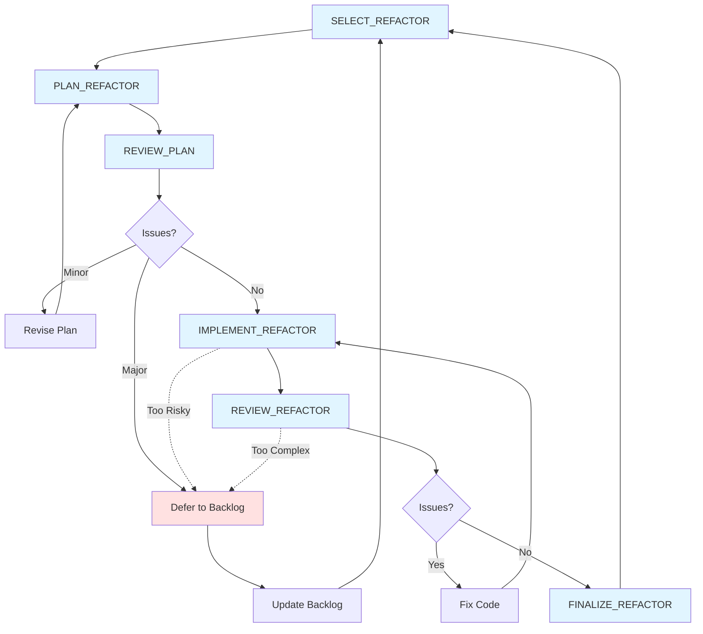

# Refactor Workflow

This diagram shows the simplified refactoring workflow for architectural improvements and pattern extraction from REFACTOR_BACKLOG.md.

## Tasks

### Primary Workflow
- **SELECT_REFACTOR**: Choose opportunity from backlog based on priority and stability; create initial description
- **PLAN_REFACTOR**: Create refactor branch; analyze impact and risk; write detailed plan with validation checklist
- **REVIEW_PLAN**: Verify plan against principles; check for scope creep and risk vs reward
- **IMPLEMENT_REFACTOR**: Execute refactor in logical stages; verify correctness at each stage
- **REVIEW_REFACTOR**: Comprehensive code review for correctness, principle alignment, and side effects
- **FINALIZE_REFACTOR**: Run validation checklist, update backlog, document learnings

## Workflow Paths

### Success Path
1. SELECT_REFACTOR → PLAN_REFACTOR → REVIEW_PLAN (pass)
2. IMPLEMENT_REFACTOR → REVIEW_REFACTOR (pass)
3. FINALIZE_REFACTOR → SELECT_REFACTOR

### Revision Path (Planning Phase)
1. REVIEW_PLAN identifies minor issues → Revise Plan → Re-review
2. REVIEW_PLAN identifies major issues → Defer to Backlog → SELECT_REFACTOR

### Revision Path (Execution Phase)
1. REVIEW_REFACTOR identifies issues → Fix Code → Re-execute

### Abort Path (Discovery Phase)
1. During IMPLEMENT_REFACTOR or REVIEW_REFACTOR, discover refactor is too risky/complex
2. Document learnings → Update Backlog with deferral reason → SELECT_REFACTOR

## Notes

- **Medium complexity**: 3-8 complexity points per refactor (between maintenance and feature workflows)
- **Stability requirement**: Only refactor systems at ≥70% certainty (check DEPENDENCY_STACK.md tree visualization)
- **Rule of three**: Patterns must appear 3+ times before extraction (verify during SELECT_REFACTOR)
- **Behavior preservation**: No new features; only simplification, clarification, or pattern extraction
- **Always reviewed**: Unlike maintenance, all refactors get full review due to architectural impact
- **Stage verification**: Execute refactors in logical stages with validation checklist verification between each
- **Manual workflow**: Each task is initiated manually; you decide when to proceed to the next step
- **Learning capture**: Document insights in Completed section (patterns that worked, anti-patterns discovered)
- **No scope creep**: Refactor only what's in the plan; track new opportunities separately
- **Validation integrated**: Validation protocol is part of PLAN_REFACTOR and executed during IMPLEMENT_REFACTOR stages
- **Single document**: All refactor phases append to the same `PLANS/refactor_<name>.md` document (description → plan → review → execution → code review → finalization); this creates a complete history in one place

## Complexity Comparison

**MAINTENANCE** (1-2 points):
- Single-file or small multi-file changes
- Code quality improvements
- Trivial fixes skip review

**REFACTOR** (3-8 points):
- Multi-file, cross-system changes
- Architectural improvements
- Always reviewed, always validated

**FEATURE** (8+ points):
- Full system implementation
- New mechanics and behaviors
- Multi-stage review process

## Integration with Other Workflows

- **From FEATURE workflow**: During FINALIZE_ITERATION, patterns discovered may populate REFACTOR_BACKLOG
- **From MAINTENANCE workflow**: During REVIEW_CODEBASE, architectural issues may be flagged for REFACTOR_BACKLOG
- **Interleave refactors**: Run between feature iterations when systems reach stability threshold
- **Prerequisite for features**: Some backlog features may require refactors first (check dependency notes)

## Stability Gates

Before selecting a refactor, verify from DEPENDENCY_STACK.md tree structure:
- **70%+ certainty**: System is mature enough to refactor safely
- **No active development**: System isn't currently being modified by feature work
- **Proven patterns**: "Rule of three" verified (3+ uses of pattern being extracted)

Defer refactors on unstable or actively-changing systems.
