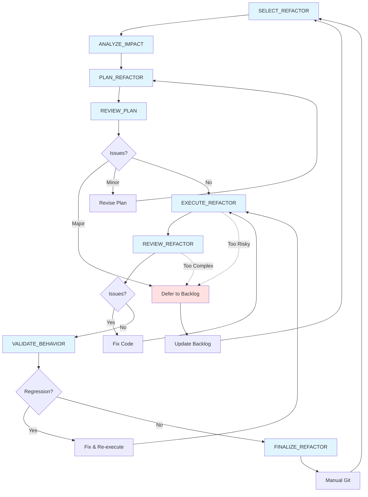

# Refactor Workflow

This diagram shows the refactoring workflow for architectural improvements and pattern extraction from REFACTOR_BACKLOG.md.

## Tasks

### Primary Workflow
- **SELECT_REFACTOR**: Choose one opportunity from REFACTOR_BACKLOG.md based on priority, system stability (certainty ≥70%), and prerequisite completion
- **ANALYZE_IMPACT**: Deep dive into affected systems; identify all call sites, dependencies, and test coverage; assess risk and create safety protocol
- **PLAN_REFACTOR**: Create detailed refactor plan with before/after examples, migration strategy, rollback plan, and validation approach
- **REVIEW_PLAN**: Verify plan against principles; check for scope creep, premature abstraction, and risk vs reward; ensure testability and stability requirements met
- **EXECUTE_REFACTOR**: Implement the refactor in logical stages (prepare → migrate → cleanup); verify correctness at each stage
- **REVIEW_REFACTOR**: Comprehensive code review checking correctness, principle alignment (clarity over cleverness, simplicity over sophistication), and unintended side effects
- **VALIDATE_BEHAVIOR**: Execute testing protocol to ensure behavior preservation (or intended changes only); verify no regressions introduced
- **FINALIZE_REFACTOR**: Update REFACTOR_BACKLOG (move to Completed), document patterns/learnings, prepare commit message, update affected documentation

### Supporting Tasks (Shared)
- **COMMIT**: Format and create git commits following project conventions

## Workflow Paths

### Success Path
1. SELECT_REFACTOR → ANALYZE_IMPACT → PLAN_REFACTOR → REVIEW_PLAN (pass)
2. EXECUTE_REFACTOR → REVIEW_REFACTOR (pass) → VALIDATE_BEHAVIOR (pass)
3. FINALIZE_REFACTOR → Manual Git → SELECT_REFACTOR

### Revision Path (Planning Phase)
1. REVIEW_PLAN identifies minor issues → Revise Plan → Re-review
2. REVIEW_PLAN identifies major issues → Defer to Backlog → SELECT_REFACTOR

### Revision Path (Execution Phase)
1. REVIEW_REFACTOR identifies issues → Fix Code → Re-execute
2. VALIDATE_BEHAVIOR identifies regression → Fix & Re-execute → Re-review

### Abort Path (Discovery Phase)
1. During EXECUTE_REFACTOR or REVIEW_REFACTOR, discover refactor is too risky/complex
2. Document learnings → Update Backlog with deferral reason → SELECT_REFACTOR

## Notes

- **Medium complexity**: Hours to 1-2 days per refactor (between maintenance and feature workflows)
- **Stability requirement**: Only refactor systems at ≥70% certainty (check DEPENDENCY_STACK.md)
- **Rule of three**: Patterns must appear 3+ times before extraction (verify during SELECT_REFACTOR)
- **Behavior preservation**: No new features; only simplification, clarification, or pattern extraction
- **Always reviewed**: Unlike maintenance, all refactors get full review due to architectural impact
- **Safety first**: Explicit rollback plan required; abort if risk exceeds reward
- **Stage verification**: Execute refactors in logical stages with verification between each
- **Manual git**: Tasks prepare but don't execute commits
- **Learning capture**: Document insights in Completed section (patterns that worked, anti-patterns discovered)
- **No scope creep**: Refactor only what's in the plan; track new opportunities separately

## Complexity Comparison

**MAINTENANCE** (minutes to hours):
- Single-file or small multi-file changes
- Code quality improvements
- Trivial fixes skip review

**REFACTOR** (hours to 1-2 days):
- Multi-file, cross-system changes
- Architectural improvements
- Always reviewed, always validated

**FEATURE** (days to weeks):
- Full system implementation
- New mechanics and behaviors
- Multi-stage review process

## Integration with Other Workflows

- **From FEATURE workflow**: During FINALIZE_ITERATION, patterns discovered may populate REFACTOR_BACKLOG
- **From MAINTENANCE workflow**: During REVIEW_CODEBASE, architectural issues may be flagged for REFACTOR_BACKLOG
- **Interleave refactors**: Run between feature iterations when systems reach stability threshold
- **Prerequisite for features**: Some backlog features may require refactors first (check dependency notes)

## Stability Gates

Before selecting a refactor, verify from DEPENDENCY_STACK.md:
- **70%+ certainty**: System is mature enough to refactor safely
- **No active development**: System isn't currently being modified by feature work
- **Proven patterns**: "Rule of three" verified (3+ uses of pattern being extracted)

Defer refactors on unstable or actively-changing systems.
