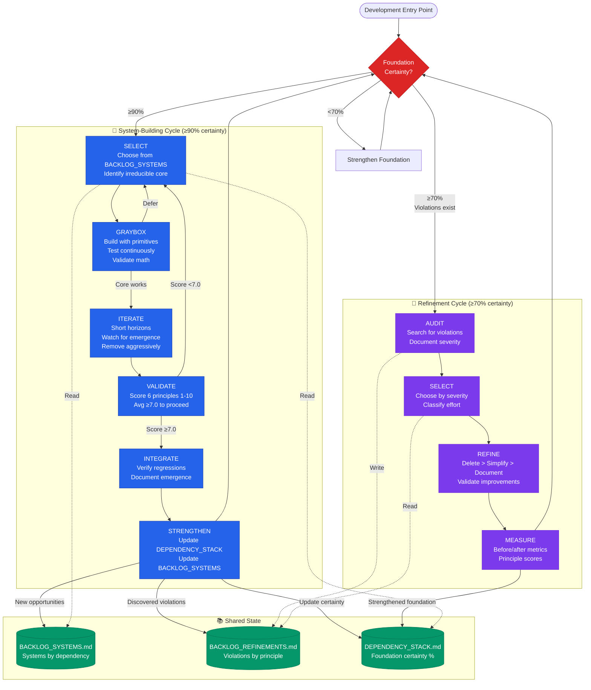

# FrogLords: Development Workflow

**Build from certainty. Iterate toward truth. Remove what doesn't serve.**

---

## The Foundation

This workflow serves the Six Pillars (@PRINCIPLES.md):

1. Radical Simplicity
2. Fundamental Composable Functions
3. Solid Mathematical Foundations
4. Emergent Behavior
5. Consistency
6. Principled Development

**When principles conflict, simplicity wins.**

---

## Philosophy

**We don't plan games—we discover them.** Development is sculpture: removing everything that doesn't serve until the form emerges.

**The dependency stack is truth.** Uncertainty multiplies upward. Build from the bottom up.

**The backlog is liquid.** Ideas are cheap. Implementation is expensive. Wait for certainty.

**Iteration replaces prediction.** Plan to the horizon of certainty. Test. Learn. Repeat.

**Graybox everything.** Validate with cubes. Polish when certain.

---

## The Two Workflows



### The Synergy

**System-Building** (blue) grows the codebase, discovers violations, strengthens foundations, enables higher layers.

**Refinement** (purple) removes complexity, restores principles, strengthens foundations, enables cleaner systems.

**Shared State** (green) tracks what to build, what to fix, and what foundations support.

**The codebase breathes:** Grow. Refine. Grow. Refine.

---

## The Dependency Stack

**File:** `DEPENDENCY_STACK.md`

Visualizes foundation certainty by layer:

```
Layer 5: POLISH       [20%] ← backlog only
Layer 4: VARIATION    [40%] ← backlog only
Layer 3: SYSTEMS      [70%] ← buildable, risky
Layer 2: PRIMITIVES   [90%] ← buildable, safe
Layer 1: CORE         [95%] ← proven, solid
```

**Rules:**
- Never build on foundations <90% certain
- Uncertainty multiplies: 0.9 × 0.9 × 0.9 = 0.73
- Update after every cycle completion

---

## Operational Principles

**Build from certainty:** ≥90% → safe to build | <90% → strengthen first

**Iterate to truth:** Planning horizon = certainty horizon

**Validate continuously:** Prove math, test until patterns emerge, score at every gate

**Exit freely:** Deferral is learning. Most systems fail in graybox—that's success.

**Remove aggressively:** Delete > Simplify > Document

**Measure everything:** Certainty %, principle scores, complexity metrics, emergence count

---

## Warning Signs

**Lost Responsiveness** • Animation over physics
**Behavioral Drift** • Accumulated state departed from truth
**Combinatorial Explosion** • Systems not orthogonal
**Debugging Blindness** • Complex behavior lacks visualization
**Special Cases** • Consistency sacrificed
**Surprising Instability** • Math not validated
**Premature Production** • Polish on unproven mechanics
**Therapeutic Planning** • Deep plans to relieve anxiety
**Zero Deferrals** • Not critical enough

---

## Cycle Details

### System-Building Steps

**SELECT** (`PLANS/<name>_SYSTEM.md`)
- Choose from `BACKLOG_SYSTEMS.md` when dependencies ≥90% certain
- Branch: `system/<name>`
- Document irreducible core

**GRAYBOX** (Update plan)
- Cubes, primitives, debug visuals only
- Prove math, test continuously
- Exit: Core works OR defer (success!)

**ITERATE** (Update plan)
- Hours to days horizon
- Ask: serve control? emerge from simpler? math correct? consistent? remove anything?
- Exit: Stable + documented emergence OR blocker

**VALIDATE** (`PLANS/<name>_REVIEW.md`)
- Score 6 principles 1-10 each
- <7.0 avg → defer/revise | ≥7.0 → proceed
- Document what emerged unexpectedly

**INTEGRATE** (Update plan)
- Remove graybox (or keep if sufficient)
- Verify no regressions
- Update debug vis

**STRENGTHEN** (Update backlogs + stack)
- Foundation now ≥90% at this layer
- Add violations → `BACKLOG_REFINEMENTS.md`
- Add opportunities → `BACKLOG_SYSTEMS.md`
- Update `DEPENDENCY_STACK.md`
- Commit: `system: add <name> to enable <emergence>`

### Refinement Steps

**AUDIT** (`BACKLOG_REFINEMENTS.md`)
- Search: magic numbers, special cases, duplicated logic, complexity without emergence, undocumented emergence, responsiveness loss, behavioral drift
- Document: principle violated, severity, location

**SELECT** (`PLANS/REFINE_<name>.md`)
- Choose by severity, foundation impact, or simplicity
- Classify: Trivial (<1h) | Standard (<1d) | Complex (>1d, defer to system cycle)

**REFINE** (Update plan)
- Delete first. Simplify second. Document last.
- Validate: principle score ↑? complexity ↓? no regressions?

**MEASURE** (Update plan)
- Before/after: LOC, cyclomatic complexity, special cases, principle scores
- Document pattern for future audits
- Commit: `refine: remove <complexity> from <system>`

---

## Getting Started

**First system:** Create backlogs → identify core → build → create dependency stack

**First refinement:** Audit code → create refinement backlog → select violation → execute

**Steady state:** Alternate. The codebase breathes: grow, refine, grow, refine.

---

## File Structure

```
/
├── PRINCIPLES.md           # The Six Pillars
├── WORKFLOW.md             # This document
├── BACKLOG_SYSTEMS.md      # Systems to build
├── BACKLOG_REFINEMENTS.md  # Violations to fix
├── DEPENDENCY_STACK.md     # Foundation state
└── PLANS/
    ├── <name>_SYSTEM.md    # System description + reflections
    ├── <name>_REVIEW.md    # Principle validation
    └── REFINE_<name>.md    # Refinement with metrics
```

**Lean. Essential. Traceable.**

---

## The Truth

We are building engines of experience.

**Build systems, not features.**
**Remove complexity, not just bugs.**
**Serve principles, not schedules.**

**This is the way.**
