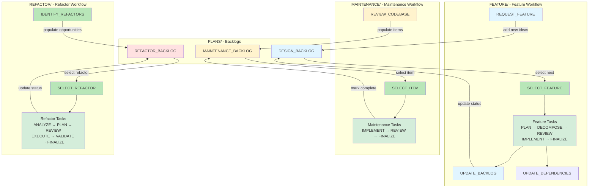

# Task Workflows

This document provides an overview of all task workflows and how backlogs feed into each workflow.

## Workflow Overview

### Feature Development Workflow
- **Location:** `TASKS/FEATURE/`
- **Purpose:** Full iteration workflow for implementing new features
- **Entry Point:** SELECT_FEATURE
- **Input Backlog:** [PLANS/DESIGN_BACKLOG.md](../PLANS/DESIGN_BACKLOG.md)
- **Details:** [FEATURE/WORKFLOW.md](FEATURE/WORKFLOW.md)

### Maintenance Workflow
- **Location:** `TASKS/MAINTENANCE/`
- **Purpose:** Quick fixes and code quality improvements
- **Entry Point:** SELECT_ITEM
- **Input Backlog:** [PLANS/MAINTENANCE_BACKLOG.md](../PLANS/MAINTENANCE_BACKLOG.md)
- **Details:** [MAINTENANCE/WORKFLOW.md](MAINTENANCE/WORKFLOW.md)

### Refactor Workflow
- **Location:** `TASKS/REFACTOR/`
- **Purpose:** Architectural improvements and pattern extraction
- **Entry Point:** SELECT_REFACTOR
- **Input Backlog:** [PLANS/REFACTOR_BACKLOG.md](../PLANS/REFACTOR_BACKLOG.md)
- **Details:** [REFACTOR/WORKFLOW.md](REFACTOR/WORKFLOW.md)

---

## Backlog-to-Workflow Mapping

### Design Backlog → Feature Workflow
**Source:** [PLANS/DESIGN_BACKLOG.md](../PLANS/DESIGN_BACKLOG.md)
**Workflow:** [FEATURE/WORKFLOW.md](FEATURE/WORKFLOW.md)
**Process:**
1. Items mature in DESIGN_BACKLOG with certainty scores and prerequisites
2. SELECT_FEATURE task selects ready items based on dependency stack
3. Feature flows through planning → implementation → finalization
4. UPDATE_BACKLOG marks items complete/deferred with learnings

**Key Tasks:**
- REQUEST_FEATURE (add new items)
- SELECT_FEATURE (select from backlog)
- UPDATE_BACKLOG (mark complete/deferred)

### Maintenance Backlog → Maintenance Workflow
**Source:** [PLANS/MAINTENANCE_BACKLOG.md](../PLANS/MAINTENANCE_BACKLOG.md)
**Workflow:** [MAINTENANCE/WORKFLOW.md](MAINTENANCE/WORKFLOW.md)
**Process:**
1. REVIEW_CODEBASE populates MAINTENANCE_BACKLOG with code quality items
2. Items prioritized by severity (Critical → High → Medium → Low)
3. SELECT_ITEM selects appropriate fixes based on available time
4. Quick fix-test-commit cycle

**Key Tasks:**
- REVIEW_CODEBASE (populate backlog)
- SELECT_ITEM (select from backlog)
- Maintenance workflow tasks (see MAINTENANCE/WORKFLOW.md)

### Refactor Backlog → Refactor Workflow
**Source:** [PLANS/REFACTOR_BACKLOG.md](../PLANS/REFACTOR_BACKLOG.md)
**Workflow:** [REFACTOR/WORKFLOW.md](REFACTOR/WORKFLOW.md)
**Process:**
1. IDENTIFY_REFACTORS populates REFACTOR_BACKLOG with pattern extraction opportunities
2. Items mature when systems reach ≥70% certainty (stability gate)
3. Follows "rule of three" (3+ uses) before extraction
4. SELECT_REFACTOR chooses ready items based on priority and stability
5. Refactor flows through analysis → planning → execution → validation → finalization

**Key Tasks:**
- IDENTIFY_REFACTORS (populate backlog)
- SELECT_REFACTOR (select from backlog)
- Refactor workflow tasks (see REFACTOR/WORKFLOW.md)

---

## Shared Utility Tasks

**Location:** `TASKS/` (root)

These tasks support all workflows:

- **COMMIT**: Format and create git commits following project conventions
- **RETROSPECTIVE**: Periodic process review to identify patterns and improve workflow (run every 5-10 iterations)

## Workflow-Specific Tasks

### Feature Workflow (`TASKS/FEATURE/`)
- **UPDATE_DEPENDENCIES**: Update DEPENDENCY_STACK.md with new certainty scores
- **UPDATE_BACKLOG**: Mark features complete/deferred in DESIGN_BACKLOG, document learnings

### Maintenance Workflow (`TASKS/MAINTENANCE/`)
- **REVIEW_CODEBASE**: Random walk through src/ to populate MAINTENANCE_BACKLOG.md

### Refactor Workflow (`TASKS/REFACTOR/`)
- **IDENTIFY_REFACTORS**: Deep system analysis to populate REFACTOR_BACKLOG.md
- **SELECT_REFACTOR**: Choose refactor opportunity from backlog based on priority and stability
- **ANALYZE_IMPACT**: Deep dive into affected systems, call sites, and risk assessment
- **PLAN_REFACTOR**: Create detailed refactor plan with migration strategy and rollback plan
- **REVIEW_PLAN**: Verify plan against principles and stability requirements
- **EXECUTE_REFACTOR**: Implement refactor in stages with verification
- **REVIEW_REFACTOR**: Comprehensive code review for correctness and principle alignment
- **VALIDATE_BEHAVIOR**: Execute testing protocol to ensure behavior preservation
- **FINALIZE_REFACTOR**: Update backlog, document learnings, prepare commits

---

## Meta-Process Tasks

- **RETROSPECTIVE**: Review last N iterations to identify workflow patterns, extract learnings, and propose process improvements (run every 5-10 iterations)

## Workflow Complexity Comparison

### MAINTENANCE (Low Complexity)
- **Complexity:** 1-2 points
- **Scope:** Single-file or small multi-file changes
- **Review:** Two-tier (trivial skip review, standard get review)
- **Purpose:** Quick fixes and code quality improvements

### REFACTOR (Medium Complexity)
- **Complexity:** 3-8 points
- **Scope:** Multi-file, cross-system changes
- **Review:** Always reviewed and validated
- **Purpose:** Architectural improvements and pattern extraction
- **Gates:** Stability requirement (≥70% certainty), rule of three verification

### FEATURE (High Complexity)
- **Complexity:** 8+ points (or split into smaller iterations)
- **Scope:** Full system implementation
- **Review:** Multi-stage (plan, step, implementation)
- **Purpose:** New mechanics and behaviors

---

## Potential Future Tasks

- **BUILD_TEST**: Formalized quality gate execution (build, lint, format, smoke test)
- **PLAYTEST_GRAYBOX**: Execute testing protocol with target sample size and metrics
- **TUNE_PARAMETERS**: Real-time parameter tuning session to achieve desired feel

