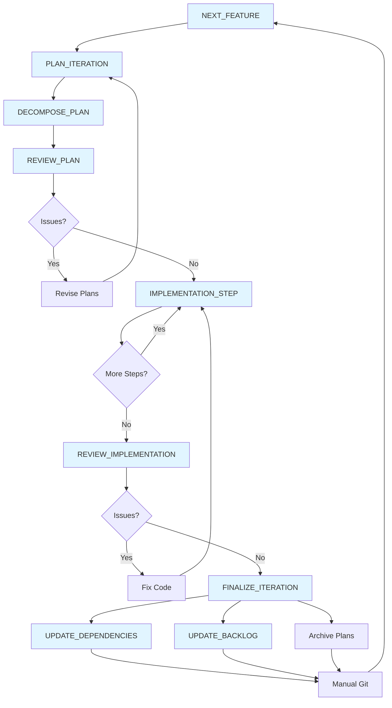

# Task Workflow

This diagram shows the complete iteration workflow and task dependencies.

## Existing Tasks

- **NEXT_FEATURE**: Identify next feature from backlog based on dependencies and certainty
- **PLAN_ITERATION**: Create detailed iteration plan with graybox scope and testing protocol
- **REVIEW_PLAN**: Check iteration plan against principles for violations and misalignments
- **DECOMPOSE_PLAN**: Break down iteration plan into atomic implementation steps
- **IMPLEMENTATION_STEP**: Execute one major step from implementation checklist
- **REVIEW_IMPLEMENTATION**: Verify code against standards and principles; approve if passing
- **FINALIZE_ITERATION**: Update stack, backlog, archive documents; prepare for next feature
- **UPDATE_DEPENDENCIES**: Update dependency_stack.md with new certainty scores
- **UPDATE_BACKLOG**: Mark features complete, document learnings, update dependent items
- **COMMIT**: Format and create git commits following project conventions

## Potential Future Tasks

- **BUILD_TEST**: Formalized quality gate execution (build, lint, format, smoke test)
- **PLAYTEST_GRAYBOX**: Execute testing protocol with target sample size and metrics
- **REFACTOR**: Extract repeated patterns into systems; clean up proven code
- **TUNE_PARAMETERS**: Real-time parameter tuning session to achieve desired feel

## Notes

- Short loops: implementation should be tight (hours to days)
- Interruptibility: revision loops at multiple decision points
- Bottom-up: dependency stack guides feature selection
- Knowledge capture: document learnings at finalization while fresh
- Manual git: tasks prepare but don't execute commits
