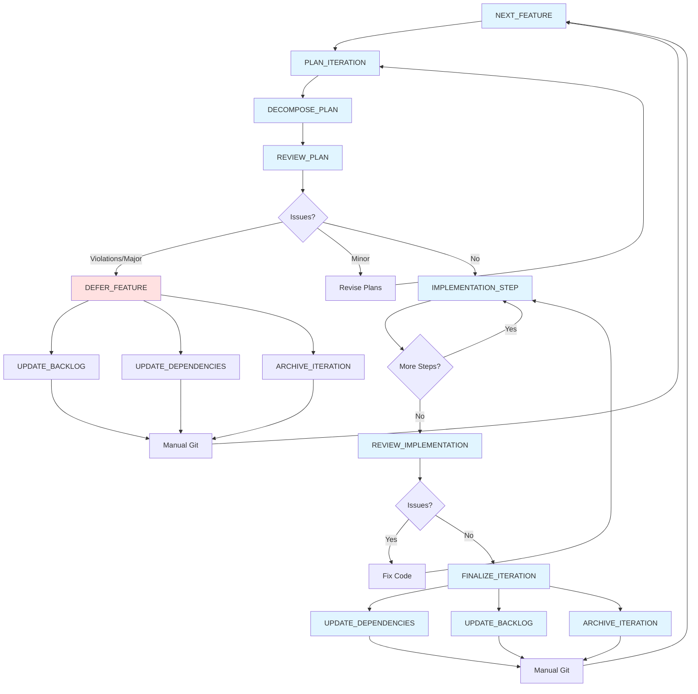

# Task Workflow

This diagram shows the complete iteration workflow and task dependencies.

## Existing Tasks

### Primary Workflow
- **NEXT_FEATURE**: Identify next feature from backlog based on dependencies and certainty
- **PLAN_ITERATION**: Create detailed iteration plan with graybox scope and testing protocol
- **DECOMPOSE_PLAN**: Break down iteration plan into atomic implementation steps
- **REVIEW_PLAN**: Check iteration plan against principles for violations and misalignments
- **IMPLEMENTATION_STEP**: Execute one major step from implementation checklist
- **REVIEW_IMPLEMENTATION**: Verify code against standards and principles; approve if passing
- **FINALIZE_ITERATION**: Update stack, backlog, archive documents; prepare for next feature

### Alternative Path
- **DEFER_FEATURE**: Cleanly back out of premature/unnecessary features identified during planning phase

### Supporting Tasks
- **UPDATE_DEPENDENCIES**: Update DEPENDENCY_STACK.md with new certainty scores
- **UPDATE_BACKLOG**: Mark features complete/deferred, document learnings, update dependent items
- **ARCHIVE_ITERATION**: Move planning documents to ARCHIVE with timestamp prefix
- **COMMIT**: Format and create git commits following project conventions
- **MERGE**: Merge feature branch to main using fast-forward only

## Potential Future Tasks

- **BUILD_TEST**: Formalized quality gate execution (build, lint, format, smoke test)
- **PLAYTEST_GRAYBOX**: Execute testing protocol with target sample size and metrics
- **REFACTOR**: Extract repeated patterns into systems; clean up proven code
- **TUNE_PARAMETERS**: Real-time parameter tuning session to achieve desired feel

## Workflow Paths

### Success Path
1. NEXT_FEATURE → PLAN_ITERATION → DECOMPOSE_PLAN → REVIEW_PLAN (pass)
2. IMPLEMENTATION_STEP (loop until complete)
3. REVIEW_IMPLEMENTATION (pass) → FINALIZE_ITERATION
4. UPDATE_DEPENDENCIES + UPDATE_BACKLOG + ARCHIVE_ITERATION → Manual Git → NEXT_FEATURE

### Deferral Path (Planning Phase)
1. NEXT_FEATURE → PLAN_ITERATION → DECOMPOSE_PLAN → REVIEW_PLAN (violations/major issues)
2. DEFER_FEATURE
3. UPDATE_BACKLOG + UPDATE_DEPENDENCIES + ARCHIVE_ITERATION → Manual Git → NEXT_FEATURE

### Revision Path
1. REVIEW_PLAN identifies minor issues → Revise Plans → Re-review
2. REVIEW_IMPLEMENTATION identifies issues → Fix Code → Re-implement

## Notes

- Short loops: implementation should be tight (hours to days)
- Interruptibility: revision loops at multiple decision points
- Deferral is cheap: celebrate avoiding expensive mistakes during planning
- Bottom-up: dependency stack guides feature selection
- Knowledge capture: document learnings at finalization/deferral while fresh
- Manual git: tasks prepare but don't execute commits
