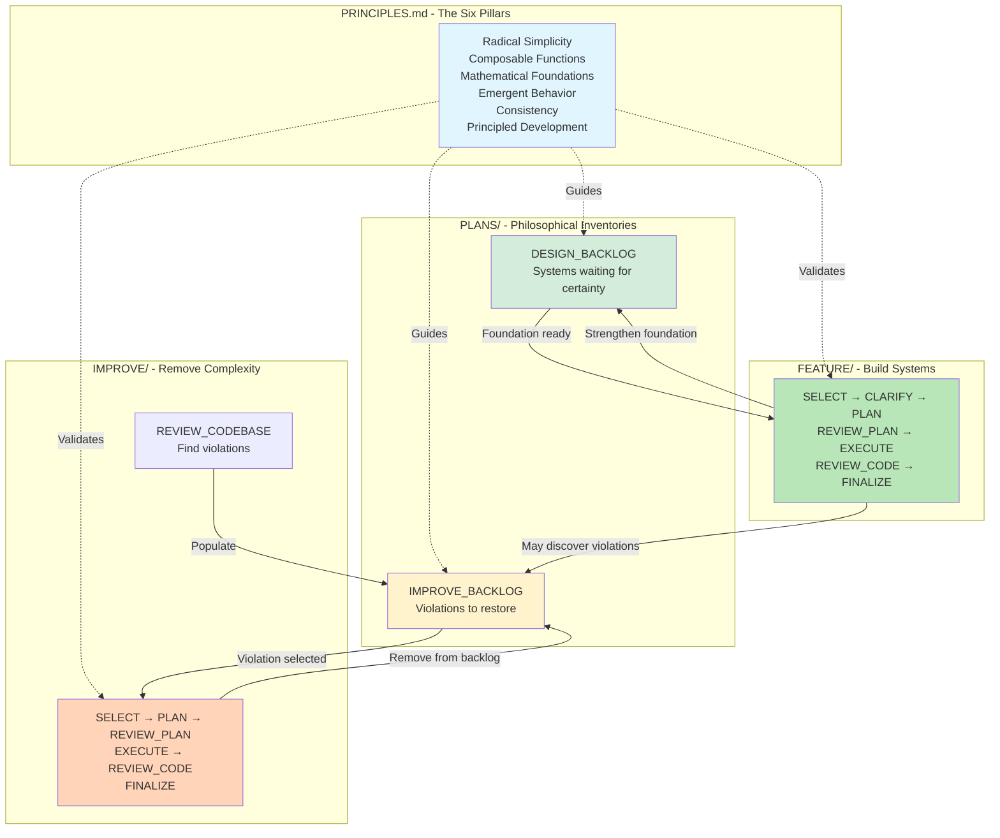

# Development Workflows

**Build systems that enable. Remove complexity that constrains. Serve principles always.**

---

## The Purpose

This is not project management—it's a philosophical framework for principled development. Two complementary workflows serve the Six Pillars: FEATURE builds systems from certainty, IMPROVE removes complexity through simplification.

**Together, they create a cycle of growth and refinement guided by principles.**

---

## The Philosophy

### The Dance of Building and Simplifying

Development has two movements:

**FEATURE (Growth):**
- Build new systems from validated foundations
- Enable emergence through simple primitives
- Strengthen certainty upward

**IMPROVE (Refinement):**
- Remove accumulated complexity
- Restore violated principles
- Simplify continuously

**Neither dominates. Both serve the principles. The codebase breathes—growing systems, removing complexity.**

### Why Two Workflows?

They serve different purposes with different constraints:

**FEATURE:**
- Requires high foundation certainty (≥90%)
- Builds upward from solid ground
- Adds capability through systems
- Longer cycle, more validation

**IMPROVE:**
- Requires moderate stability (≥70%)
- Works within existing code
- Removes unnecessary complexity
- Shorter cycle, focused changes

**The distinction reflects the risk profile and philosophical intent.**

### The Role of Backlogs

Backlogs are not task lists—they're philosophical inventories:

**DESIGN_BACKLOG:**
- Systems waiting for foundation certainty
- Ideas maturing with understanding
- Dependencies mapped and tracked

**IMPROVE_BACKLOG:**
- Principle violations to restore
- Complexity to remove
- Patterns to recognize

**Both organize work by principles, not features or deadlines.**

---

## System Overview



---

## The Two Workflows

### FEATURE Workflow (`TASKS/FEATURE/`)

**Purpose:** Build systems that enable emergence

**Tasks:**
1. **SELECT** - Choose from backlog based on foundation
2. **CLARIFY** - Transform features into systems (optional)
3. **PLAN** - Prove system should be built
4. **REVIEW_PLAN** - Validate against all principles
5. **EXECUTE** - Build validated stages
6. **REVIEW_CODE** - Verify principles maintained
7. **FINALIZE** - Capture learning, update foundation

**Philosophy:** Build from certainty toward uncertainty. Each system strengthens the foundation for what comes next.

**When to use:** When adding new capabilities, building primitives, enabling new behaviors.

**See:** `TASKS/FEATURE/WORKFLOW.md` for details

---

### IMPROVE Workflow (`TASKS/IMPROVE/`)

**Purpose:** Remove complexity, restore principles

**Tasks:**
1. **SELECT** - Choose violation, classify complexity
2. **PLAN** - Plan simplification (Path B only)
3. **REVIEW_PLAN** - Validate simplification (Path B only)
4. **EXECUTE** - Delete or simplify (both paths)
5. **REVIEW_CODE** - Verify reduction (Path B only)
6. **FINALIZE** - Measure and document (both paths)

**Special:** **REVIEW_CODEBASE** - Find violations to populate backlog

**Philosophy:** Always try deletion first. Simplification second. Documentation last. Most improvements should remove code.

**When to use:** Between features, when violations accumulate, when foundation stable enough (≥70%).

**See:** `TASKS/IMPROVE/WORKFLOW.md` for details

---

## How They Work Together

### The Development Cycle

```
1. Build feature (FEATURE workflow)
   ↓
2. Foundation strengthened, possibly introduced violations
   ↓
3. Review codebase (REVIEW_CODEBASE)
   ↓
4. Remove complexity (IMPROVE workflow)
   ↓
5. Foundation cleaner and stronger
   ↓
6. Ready for next feature (repeat)
```

**This cycle never ends. Building and simplifying are continuous.**

### When to Use Each

**Use FEATURE when:**
- Foundation certain enough (≥90%)
- Building new capability
- Adding primitives
- Enabling emergence
- Dependencies satisfied

**Use IMPROVE when:**
- Foundation stable enough (≥70%)
- Between features
- Violations accumulating
- Technical debt visible
- No active feature work

**Use neither when:**
- Foundation too uncertain
- Major changes in progress
- Better to stabilize first

---

## The Principles in Action

### 1. Radical Simplicity
**FEATURE:** Build minimal primitives, not feature sets
**IMPROVE:** Delete first, simplify second, document last
**Result:** Codebase stays simple despite growth

### 2. Fundamental Composable Functions
**FEATURE:** Each system orthogonal to others
**IMPROVE:** Untangle dependencies, separate concerns
**Result:** Systems compose without special cases

### 3. Solid Mathematical Foundations
**FEATURE:** Validate math before integration
**IMPROVE:** Derive magic numbers, prove correctness
**Result:** Every behavior mathematically sound

### 4. Emergent Behavior
**FEATURE:** Enable outcomes, don't prescribe them
**IMPROVE:** Remove prescribed behaviors
**Result:** Systems surprise even creators

### 5. Consistency
**FEATURE:** Predictable behavior, preserved control
**IMPROVE:** Eliminate special cases
**Result:** Player trust maintained

### 6. Principled Development
**FEATURE:** Every decision justified
**IMPROVE:** Every change restores a principle
**Result:** Can trace all code to principles

---

## Key Operational Principles

### Build From Certainty

The dependency stack guides what to build:
- Foundation ≥90% → Safe to build on
- Foundation <90% → Wait or improve foundation first
- Truth flows upward, never down

**Never build on sand. Always strengthen the foundation.**

### Validate Continuously

Both workflows require validation at gates:
- Mathematical correctness proven
- Debug visualization functional
- Principle adherence verified
- No regressions introduced

**Validation is not optional. It's how we build truth.**

### Exit Freely

Deferral available at any point in either workflow:
- Learn we shouldn't proceed
- Foundation too uncertain
- Principles can't be maintained
- Better to defer and learn

**Deferral is learning, not failure.**

### Document Learning

Every cycle teaches:
- What emerged (FEATURE)
- What patterns recur (IMPROVE)
- How to calibrate certainty
- Where principles guide us

**Learning compounds. Document it.**

### Measure Everything

Objective metrics prevent self-deception:
- Foundation certainty (%)
- Complexity reduction (lines, dependencies)
- Principle adherence (1-10 per pillar)
- Emergence events (count)

**What gets measured gets improved.**

---

## Backlog Integration

### DESIGN_BACKLOG (`PLANS/DESIGN_BACKLOG.md`)

**Purpose:** Systems awaiting foundation certainty

**Structure:**
- Organized by certainty required
- Tracks dependencies
- Includes emergence opportunities
- Notes when foundation ready

**Philosophy:** Ideas are cheap. Implementation is expensive. Wait for certainty before building.

**Populated by:**
- Feature completion (new possibilities discovered)
- External inspiration (REQUEST)
- Emergence during development

**Selected by:** FEATURE/SELECT based on foundation state

---

### IMPROVE_BACKLOG (`PLANS/IMPROVE_BACKLOG.md`)

**Purpose:** Principle violations to restore

**Structure:**
- Organized by principle violated
- Prioritized by severity
- Includes pattern notes
- Complexity estimation

**Philosophy:** Violations accumulate silently. Audits make them visible.

**Populated by:**
- REVIEW_CODEBASE audits
- Discoveries during FEATURE work
- Code reviews

**Selected by:** IMPROVE/SELECT based on priority and foundation stability

---

## Complexity Guidelines

### FEATURE Complexity

All features follow full workflow:
- Requires ≥90% foundation certainty
- Full validation at every gate
- Mathematical proof required
- Debug visualization mandatory

**No shortcuts in system building.**

### IMPROVE Complexity

Two paths based on risk:

**Path A: Trivial (1-2 points)**
- SELECT → EXECUTE → FINALIZE
- Obvious fixes
- Low risk
- Fast cycle

**Path B: Standard (3-8 points)**
- SELECT → PLAN → REVIEW_PLAN → EXECUTE → REVIEW_CODE → FINALIZE
- Complex simplification
- Higher risk
- Careful approach

**Path selection based on risk, not effort.**

---

## Document Organization

### Task Files

```
TASKS/
├── WORKFLOW.md              - This document
├── RETROSPECTIVE.md         - Reflection and learning
├── COMMIT.md                - Git commit workflow
│
├── FEATURE/
│   ├── WORKFLOW.md         - Feature workflow details
│   ├── SELECT.md
│   ├── CLARIFY.md
│   ├── PLAN.md
│   ├── REVIEW_PLAN.md
│   ├── EXECUTE.md
│   ├── REVIEW_CODE.md
│   └── FINALIZE.md
│
└── IMPROVE/
    ├── WORKFLOW.md         - Improve workflow details
    ├── SELECT.md
    ├── PLAN.md
    ├── REVIEW_PLAN.md
    ├── EXECUTE.md
    ├── REVIEW_CODE.md
    ├── FINALIZE.md
    └── REVIEW_CODEBASE.md
```

### Plan Files

```
PLANS/
├── DESIGN_BACKLOG.md           - Systems to build
├── IMPROVE_BACKLOG.md          - Violations to fix
├── DEPENDENCY_STACK.md         - Foundation state
│
├── <feature>_FEATURE.md        - Feature description & reflection
├── <feature>_PLAN.md           - Implementation stages
├── <feature>_PLAN_REVIEW.md    - Plan approval
├── <feature>_CODE_REVIEW.md    - Code approval
│
└── IMPROVE_<name>.md           - All improvement phases
```

---

## Getting Started

### New to the Project?

1. **Read /PRINCIPLES.md** - Understand the Six Pillars
2. **Read this document** - Understand the workflows
3. **Read FEATURE/WORKFLOW.md** - Understand system building
4. **Read IMPROVE/WORKFLOW.md** - Understand simplification

### Starting Feature Work?

1. Check `PLANS/DEPENDENCY_STACK.md` for foundation state
2. Review `PLANS/DESIGN_BACKLOG.md` for available systems
3. Start with `TASKS/FEATURE/SELECT.md`
4. Follow workflow in `TASKS/FEATURE/WORKFLOW.md`

### Starting Improvement Work?

1. Check foundation stability (≥70%)
2. Review `PLANS/IMPROVE_BACKLOG.md` for violations
3. Start with `TASKS/IMPROVE/SELECT.md`
4. Follow workflow in `TASKS/IMPROVE/WORKFLOW.md`

### Need to Audit?

1. Run `TASKS/IMPROVE/REVIEW_CODEBASE.md`
2. Populates `PLANS/IMPROVE_BACKLOG.md`
3. Then proceed with IMPROVE workflow

---

## Meta-Processes

Beyond the two main workflows, occasional meta-processes maintain the system:

### RETROSPECTIVE (`TASKS/RETROSPECTIVE.md`)
**When:** Every 5-10 completed cycles
**Purpose:** Reflect on patterns, celebrate emergence, learn from violations
**Philosophy:** Each cycle teaches. Retrospectives capture the wisdom.

---

## The Commitment

This development system exists to:

- **Serve the Six Pillars** - Every workflow validates principles
- **Build from certainty** - Foundation guides what's possible
- **Enable emergence** - Systems enable, don't prescribe
- **Remove complexity** - Continuous simplification
- **Capture learning** - Wisdom compounds over time
- **Measure objectively** - Truth over intuition

This development system never:

- Prescribes outcomes over enabling possibilities
- Rushes through gates to "ship it"
- Skips validation to save time
- Adds complexity for convenience
- Builds on uncertain foundations
- Ignores principle violations

---

## The Vision

This is not a game development process. This is **principled system building** that happens to create gameplay.

The workflows exist to:
1. Protect principles throughout development
2. Build systems that surprise their creators
3. Remove complexity continuously
4. Strengthen foundations iteratively
5. Enable emergence at every level
6. Make every decision traceable

**When faced with any choice, return to /PRINCIPLES.md. The Six Pillars guide everything.**

---

## The Truth

We are building engines of experience—machines that transform player intent into emotion through mathematically correct, radically simple, emergent systems.

Every feature we build serves this purpose.
Every improvement we make serves this purpose.
Every principle we uphold serves this purpose.

**The workflows are not the goal. Principle-aligned emergent gameplay is the goal. The workflows serve the principles. The principles serve the players.**

**This is the way.**