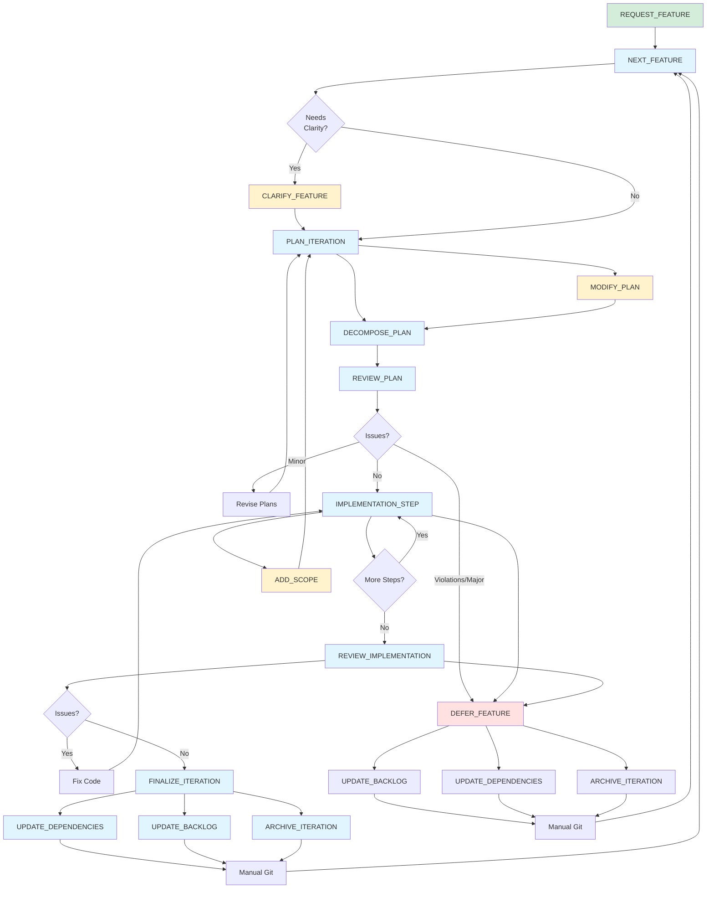

# Task Workflow

This diagram shows the complete iteration workflow and task dependencies.

## Existing Tasks

### Pre-Workflow
- **REQUEST_FEATURE**: Propose a new feature for evaluation and backlog entry

### Primary Workflow
- **NEXT_FEATURE**: Identify next feature from backlog based on dependencies and certainty; write high-level feature description and save to `PLANS/feature_<feature_name>.md`
- **CLARIFY_FEATURE**: (Optional) Eliminate ambiguity by asking targeted questions before planning; captures visual references and concrete requirements
- **PLAN_ITERATION**: Create detailed iteration plan from feature description with graybox scope and testing protocol
- **DECOMPOSE_PLAN**: Break down iteration plan into atomic implementation steps; update existing plan with changelog if it exists
- **REVIEW_PLAN**: Check iteration and implementation plans against principles; prepend changelog entry on re-review
- **IMPLEMENTATION_STEP**: Execute one major step from implementation checklist; mark completed items and track changed files
- **REVIEW_IMPLEMENTATION**: Verify code against standards and principles; approve if passing
- **FINALIZE_ITERATION**: Update stack, backlog, archive documents; prepare for next feature

### Mid-Iteration Adjustments
- **ADD_SCOPE**: Add requirements to an active iteration plan (triggers re-decompose)
- **MODIFY_PLAN**: Update implementation plan to match modified iteration scope

### Alternative Path
- **DEFER_FEATURE**: Cleanly back out of premature/unnecessary features identified during planning or implementation phase

### Supporting Tasks
- **UPDATE_DEPENDENCIES**: Update DEPENDENCY_STACK.md with new certainty scores
- **UPDATE_BACKLOG**: Mark features complete/deferred, document learnings, update dependent items
- **ARCHIVE_ITERATION**: Move planning documents to ARCHIVE with timestamp prefix
- **COMMIT**: Format and create git commits following project conventions
- **MERGE**: Merge feature branch to main using fast-forward only

## Potential Future Tasks

- **BUILD_TEST**: Formalized quality gate execution (build, lint, format, smoke test)
- **PLAYTEST_GRAYBOX**: Execute testing protocol with target sample size and metrics
- **REFACTOR**: Extract repeated patterns into systems; clean up proven code
- **TUNE_PARAMETERS**: Real-time parameter tuning session to achieve desired feel

## Workflow Paths

### Feature Request Path
1. REQUEST_FEATURE → Evaluate against principles & dependencies
2. Add to backlog if viable → Eventually pulled via NEXT_FEATURE

### Success Path
1. NEXT_FEATURE → (Optional: CLARIFY_FEATURE) → PLAN_ITERATION → DECOMPOSE_PLAN → REVIEW_PLAN (pass)
2. IMPLEMENTATION_STEP (loop until complete)
3. REVIEW_IMPLEMENTATION (pass) → FINALIZE_ITERATION
4. UPDATE_DEPENDENCIES + UPDATE_BACKLOG + ARCHIVE_ITERATION → Manual Git → NEXT_FEATURE

### Deferral Path (Planning Phase)
1. NEXT_FEATURE → (Optional: CLARIFY_FEATURE) → PLAN_ITERATION → DECOMPOSE_PLAN → REVIEW_PLAN (violations/major issues)
2. DEFER_FEATURE
3. UPDATE_BACKLOG + UPDATE_DEPENDENCIES + ARCHIVE_ITERATION → Manual Git → NEXT_FEATURE

### Deferral Path (Implementation Phase)
1. During IMPLEMENTATION_STEP or REVIEW_IMPLEMENTATION, discover blockers/missing prerequisites
2. DEFER_FEATURE
3. UPDATE_BACKLOG + UPDATE_DEPENDENCIES + ARCHIVE_ITERATION → Manual Git → NEXT_FEATURE

### Revision Path
1. REVIEW_PLAN identifies minor issues → Revise Plans → Re-review (prepends changelog to review)
2. REVIEW_IMPLEMENTATION identifies issues → Fix Code → Re-implement

### Mid-Iteration Scope Change Path
1. During IMPLEMENTATION_STEP, discover need for scope adjustment
2. ADD_SCOPE → Update iteration plan with changelog entry
3. MODIFY_PLAN → Update implementation plan with changelog entry
4. DECOMPOSE_PLAN → Synchronize implementation steps (adds changelog if updating existing plan)
5. Return to IMPLEMENTATION_STEP with synchronized plans

## Notes

- Short loops: implementation should be tight (hours to days)
- Interruptibility: revision loops at multiple decision points
- Clarification upfront: use CLARIFY_FEATURE when ambiguity exists; visual references prevent wasted iteration loops
- Deferral is cheap: celebrate avoiding expensive mistakes during planning or implementation
- Deferral phases: planning phase (principle violations, premature features) and implementation phase (missing prerequisites, blockers discovered)
- Bottom-up: dependency stack guides feature selection
- Knowledge capture: document learnings at finalization/deferral while fresh
- Manual git: tasks prepare but don't execute commits
- Scope changes: ADD_SCOPE + MODIFY_PLAN + DECOMPOSE_PLAN keep plans synchronized when discovery requires mid-iteration adjustment
- Feature requests: REQUEST_FEATURE formalizes backlog entry with principle alignment and dependency analysis
- Plan versioning: DECOMPOSE_PLAN and REVIEW_PLAN add changelog entries when updating existing plans; IMPLEMENTATION_STEP tracks changed files
- Re-reviews: REVIEW_PLAN prepends changelog entries on re-review to maintain historical context
