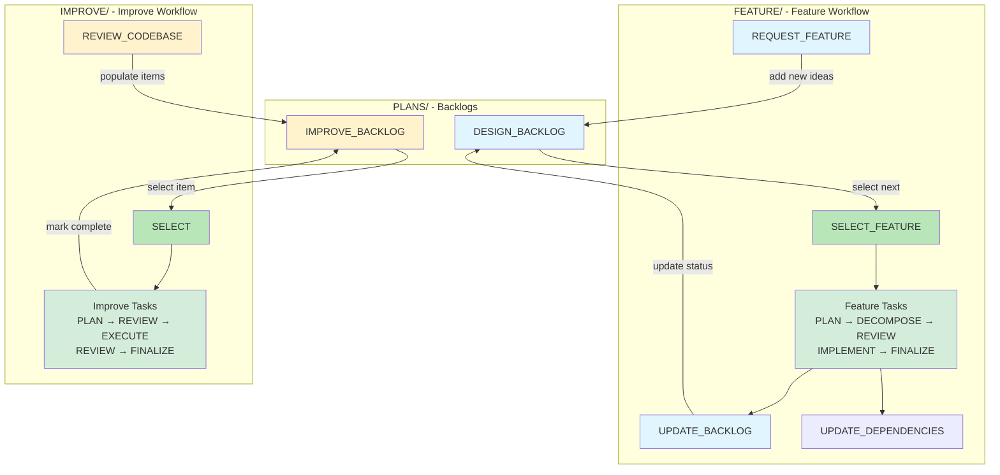

# Task Workflows

This document provides an overview of all task workflows and how backlogs feed into each workflow.

## Workflow Overview

## Document Naming Conventions

Workflow documents follow distinct naming patterns optimized for their usage:

### Feature Documents (Feature-First)
**Pattern:** `PLANS/<feature_name>_<WORKFLOW>.md`  
**Archive:** `YYYYMMDD_HHMMSS_<feature_name>_<WORKFLOW>.md`

- `<feature_name>_FEATURE.md` - Feature description and rationale
- `<feature_name>_PLAN.md` - Detailed implementation steps
- `<feature_name>_CODE_REVIEW.md` - Implementation review findings
- `<feature_name>_PLAN_REVIEW.md` - Planning review findings

**Rationale:** Features involve multi-phase iterative work. Grouping by feature name clusters all related documents together alphabetically, making it easy to see the complete arc of a feature at a glance (planning → implementation → reviews).

### Improve Documents (Workflow-First)
**Pattern:** `PLANS/IMPROVE_<description>.md`  
**Archive:** `YYYYMMDD_HHMMSS_IMPROVE_<description>.md`

**Rationale:** Improvements (maintenance, refactors, architectural fixes) are typically one-off enhancements. Grouping by workflow type (IMPROVE_) clusters all improvement work together, aiding pattern recognition and retrospective analysis of code quality evolution.

### Feature Development Workflow
- **Location:** `TASKS/FEATURE/`
- **Purpose:** Complete feature development workflow for implementing new features
- **Entry Point:** SELECT_FEATURE
- **Input Backlog:** [PLANS/DESIGN_BACKLOG.md](../PLANS/DESIGN_BACKLOG.md)
- **Details:** [FEATURE/WORKFLOW.md](FEATURE/WORKFLOW.md)
- **Document Approach:** Multi-file with feature-first naming (`PLANS/<name>_FEATURE.md`, `<name>_PLAN.md`, `<name>_CODE_REVIEW.md`, `<name>_PLAN_REVIEW.md`)
 - **Common Checkpoints:** Gate Mechanism Review (prefer geometric deltas over thresholds for reactive/debug gating), UI Ordering Verified (enum order matches UI for cycle-based lists)

### Improve Workflow
- **Location:** `TASKS/IMPROVE/`
- **Purpose:** Code quality improvements, architectural fixes, tech debt, and pattern extraction
- **Entry Point:** SELECT
- **Input Backlog:** [PLANS/IMPROVE_BACKLOG.md](../PLANS/IMPROVE_BACKLOG.md)
- **Details:** [IMPROVE/WORKFLOW.md](IMPROVE/WORKFLOW.md)
- **Document Approach:** Single document per improvement (`PLANS/IMPROVE_<name>.md`) accumulates all phases
- **Paths:** Trivial (1-2 pts, skip planning/review) or Standard (3-8 pts, full workflow)

---

## Backlog-to-Workflow Mapping

### Design Backlog → Feature Workflow
**Source:** [PLANS/DESIGN_BACKLOG.md](../PLANS/DESIGN_BACKLOG.md)
**Workflow:** [FEATURE/WORKFLOW.md](FEATURE/WORKFLOW.md)
**Process:**
1. Items mature in DESIGN_BACKLOG with certainty scores and prerequisites
2. SELECT_FEATURE task selects ready items based on dependency stack
3. Feature flows through planning → implementation → finalization
4. UPDATE_BACKLOG marks items complete/deferred with learnings

**Key Tasks:**
- REQUEST_FEATURE (add new items)
- SELECT_FEATURE (select from backlog)
- UPDATE_BACKLOG (mark complete/deferred)

### Improve Backlog → Improve Workflow
**Source:** [PLANS/IMPROVE_BACKLOG.md](../PLANS/IMPROVE_BACKLOG.md)
**Workflow:** [IMPROVE/WORKFLOW.md](IMPROVE/WORKFLOW.md)
**Process:**
1. REVIEW_CODEBASE populates IMPROVE_BACKLOG with code quality items, architectural violations, tech debt, and pattern extraction opportunities
2. Items prioritized by severity/priority (Critical → High → Medium → Low)
3. Items must meet stability gate (≥70% certainty) and rule of three (for pattern extractions)
4. SELECT chooses appropriate improvements based on complexity and readiness
5. Trivial items (1-2 pts) skip planning/review; Standard items (3-8 pts) get full workflow

**Key Tasks:**
- REVIEW_CODEBASE (populate backlog)
- SELECT (select from backlog)
- PLAN (Standard path only - create detailed approach)
- REVIEW_PLAN (Standard path only - verify against principles)
- EXECUTE (implement changes in stages)
- REVIEW_CODE (Standard path only - comprehensive review)
- FINALIZE (update backlog, document learnings, prepare commit)

---

## Shared Utility Tasks

**Location:** `TASKS/` (root)

These tasks support all workflows:

- **COMMIT**: Format and create git commits following project conventions

## Workflow-Specific Tasks

### Feature Workflow (`TASKS/FEATURE/`)
- **UPDATE_DEPENDENCIES**: Update DEPENDENCY_STACK.md with new certainty scores
- **UPDATE_BACKLOG**: Mark features complete/deferred in DESIGN_BACKLOG, document learnings

### Improve Workflow (`TASKS/IMPROVE/`)
- **REVIEW_CODEBASE**: Systematic review of src/ to populate IMPROVE_BACKLOG.md with code quality items, architectural violations, tech debt, and pattern extraction opportunities

---

## Meta-Process Tasks

- **RETROSPECTIVE**: Review last N iterations to identify workflow patterns, extract learnings, and propose process improvements (run every 5-10 iterations)
- **UNDERSTAND_CONCEPT**: Build conceptual knowledge through discussion, research, and documentation. Create intellectual capital that informs future problem-solving (run anytime to eliminate uncertainty)
- **ALIGN_TASKS**: Ensure all workflow tasks maintain consistent structure, tone, format, and principle alignment. Prevents drift when individual tasks are updated (run when tasks are modified, principles change, or during periodic audits)
- **SYNC_PRINCIPLES**: Keep `AGENTS.md` and principle guidance aligned with live architecture and curated NOTES references; verify PLANS trigger sections; optionally normalize encodings (run after architectural changes, notes updates, or periodically)

## Workflow Complexity Comparison

### IMPROVE (Low to Medium Complexity)
- **Complexity:** 1-8 points (two paths)
- **Trivial Path (1-2 pts):** Single-file, mechanical changes; skip planning/review
- **Standard Path (3-8 pts):** Multi-file, architectural changes; full workflow with planning and review
- **Purpose:** Code quality improvements, architectural fixes, tech debt, pattern extraction
- **Gates:** Stability requirement (≥70% certainty), rule of three verification (for pattern extractions)

### FEATURE (High Complexity)
- **Complexity:** 8+ points (or split into smaller iterations)
- **Scope:** Full system implementation
- **Review:** Multi-stage (plan, step, implementation)
- **Purpose:** New mechanics and behaviors

---

## Potential Future Tasks

- **BUILD_TEST**: Formalized quality gate execution (build, lint, format, smoke test)
- **PLAYTEST_GRAYBOX**: Execute testing protocol with target sample size and metrics
- **TUNE_PARAMETERS**: Real-time parameter tuning session to achieve desired feel

